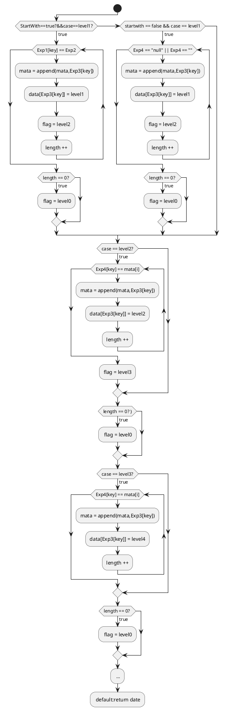
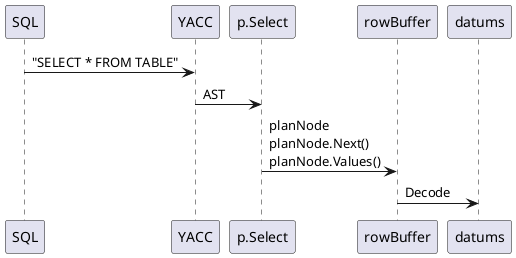

- Feature Name: recursive_StartWith
- Status: Processing
- Start Date: 2020-09-11
- Authors: Zhijin Ruan
- RFC PR:
- Bidb Issue: 


# Summary
　　`START WITH`是Oracle级联查询的条件子句，使用时，规定此次查询的起点；单独使用`CONNECT BY PRIOR`也可以实现级联查询，查询结果是满足级联条件的所有数据。
	Oracle级联查询查询语法为：
```　
      SELECT last_name, employee_id, manager_id, LEVEL FROM employees
      START WITH employee_id = 100
      CONNECT BY PRIOR employee_id = manager_id
      ORDER SIBLINGS BY last_name;
```
# Motivation
对于具有树状结构的数据表，级联查询可以快速查找目标节点的所有子孙节点或所有祖辈节点，应客户的需求需要支持Oracle级联查询语法，而DRDB缺少此功能。

# Detailed design
 __一：先实现DRDB兼容Oracle的级联查询：__<br>
DRDB已兼容Postgres的级联查询，查询语法为：
```
WITH RECURSIVE subordinates AS (
   SELECT id,title, p_id FROM menu WHERE id = 1
   UNION
   SELECT e.id, e.title,e.p_id FROM menu e INNER JOIN subordinates s ON s.id = e.p_id
) SELECT * FROM subordinates;
```
语法树如下图所示：
<br>
上图左半部分是主查询`SELECT * FROM subordinate`，Oracle的主查询语句可直接复用。只需要重构右半部`With`的语法树，构造等同的语法树即可复用Postgres的级联查询来实现Oracle的级联查询。
`With`部分主体是`Union`类型的`Select`语句，包含`左Select`语句（初始化条件）和`右Select`语句（递归条件）同时包含临时表，所以重构语法树时候需要在YACC层构造一个临时表，然后将Oracle级联查询的初始化条件`START WITH`子句置于语法树(蓝色)Left(Select) →SelectClause→Where中，完成`左Select`的语法重构。<br>
`With`语法的`右Select`语句：
```
SELECT e.id, e.title,e.p_id FROM menu e INNER JOIN subordinates s ON s.id = e.p_id
```
其FROM子句是INNER JOIN类型，构造会比较复杂，而且整个语句与查询语句
```
SELECT e.id,e.title,e.p_id FROM menu e, subordinates s WHERE s.id = e.p_id
```
查询效果是等同的，因此`右Select`的语法树可改造成`SELECT...FROM...WHERE`语法树，然后将Oracle的递归条件`CONNECT BY PRIOR`子句置于`WHERE`中完成`右SELECT`的语法重构。<br>
__注意:左Select和右Select的Exprs需要构造成Select *格式<br>__
以上完成Oracle语法树的重构便可复用Postgres的查询功能。<br>
<br>
<br>
__二、实现Oracle级联查询的具体行为：__<br>
  __1、没有`START WITH`子句也可以实现级联查询<br>__
   可在YACC层实现，修改START WITH的规约，增加空规约并解决相应的冲突。<br>
  __2、`START WITH`与`ORDER SIBLINGS BY`交换位置也能实现功能<br>__
  可在YACC层实现，增加一条交换位置后的规约，并解决相应的冲突。<br>
  __3、支持`ORDER SIBLINGS BY`排序，且`ORDER SIBLINGS BY`必须在查询语句末端<br>__
   可在YACC层实现，增加关键字SIBLINGS，将ORDER SIBLINGS BY规约语句置于句末并解决相应冲突。<br>
   __4、支持`LEVEL`伪列，显示数据所属层级；支持`connect_by_isleaf`伪列，显示对应的数据是否是一个叶子节点；支持`connect_by_root`伪列，显示对应列的根数据；支持`sys_connect_by_path`伪列，显示根节点（`START WITH`条件）到当前节点的路径；支持connect_by_iscycle伪列，显示哪一条数据循环__<br>
  LEVEL、connect_by_isleaf、connect_by_root、sys_connect_by_path、connect_by_iscycle五种伪列均可通过在语义解析阶段buildSelectClause时候修改inScop来实现增加列，并根据每列的表达式按照各自所需的功能构建表达式。<br>
 
  * LEVEL列：由于LEVEL列难以用简单表达式算出，可通过在Eval()函数传入一个MAP表，然后根据传入的表数据查询MAP表得出值来填充LEVEL列。MAP表需要获取查询语句
 ```　
      SELECT last_name, employee_id, manager_id, LEVEL FROM employees
      START WITH Exp1 = Exp2
      CONNECT BY PRIOR Exp3 = Exp4
      ORDER SIBLINGS BY last_name;
```
中表employees的Exp1、Exp3、Exp4三列的数据以及Exp2的值并保存下来，将数据传入增加的函数Level()得到MAP表,算法流程图如下<br>

  Exp1、Exp3、Exp4等三列的数据可通过手动填充“SELECT * FROM TABLE”SQL语句经过YACC和planNode获取。<br>

  * connect_by_isleaf列：同LEVEL列，可通过算法函数得到MAP表，查MAP表填充connect_by_isleaf列。<br>
  * connect_by_root列：同LEVEL列，可通过算法函数得到MAP表，查MAP表填充connect_by_root列。<br>
  * sys_connect_by_path列：同LEVEL列，可通过算法函数得到MAP表，查MAP表填充sys_connect_by_path列。<br>
  * connect_by_iscycle列：同LEVEL列，可通过算法函数得到MAP表，查MAP表填充connect_by_iscycle列。<br>

 
   __5、输出数据按照类树形结构显示<br>__


# Drawbacks

需要在YACC层重构整个AST，可读性不好

# Alternatives

不复用Postgres的级联查询，重新开发兼容Oracle级联查询的功能


# Unresolved questions
YACC层增加`START WITH`必然产生语法冲突
# Test dimension
* __黑盒测试（功能测试、性能测试）：__ 满足Oracle级联查询的所有功能和行为，能及时响应并稳定输出查询数据。可通过人工测试以及测试用例自动测试
* __白盒测试：__ 可通过Code Review ，提升代码质量，发掘潜在BUG
* __回归测试：__ 如果出现bug，修复bug后，把之前的测试用例再次应用到修复后的版本上进行测试
* __随机测试：__ 对重要功能进行复测，也包括测试那些当前的测试用例没有覆盖到的部分
