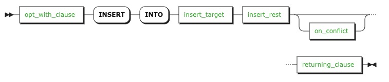
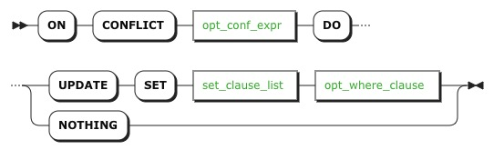
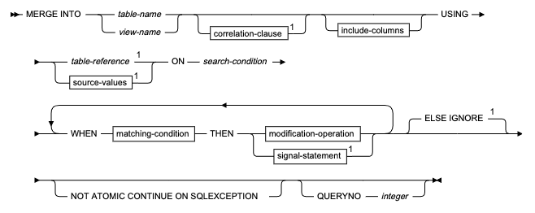
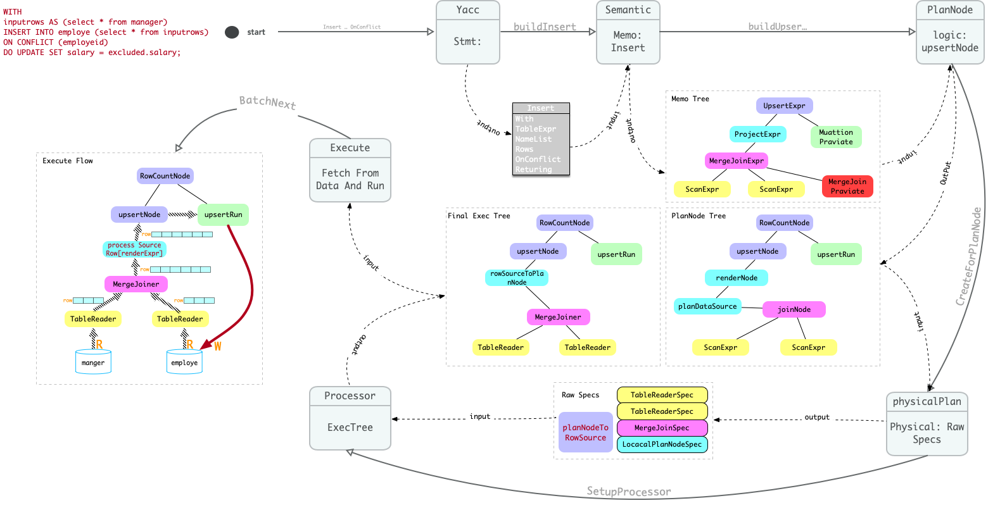
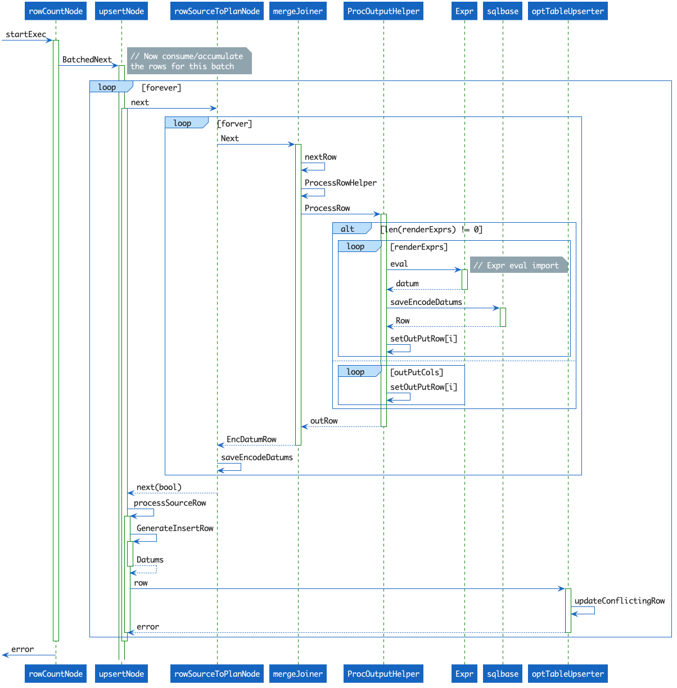
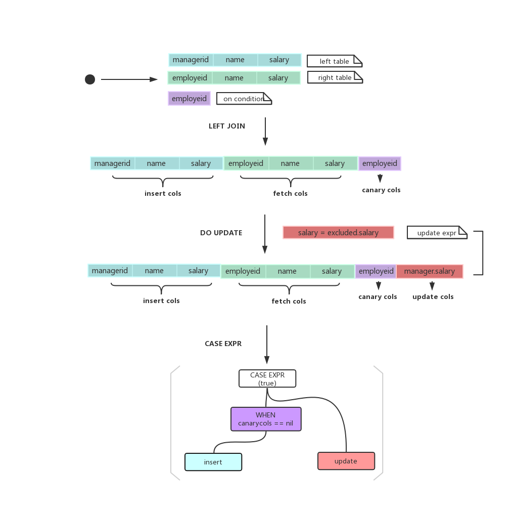
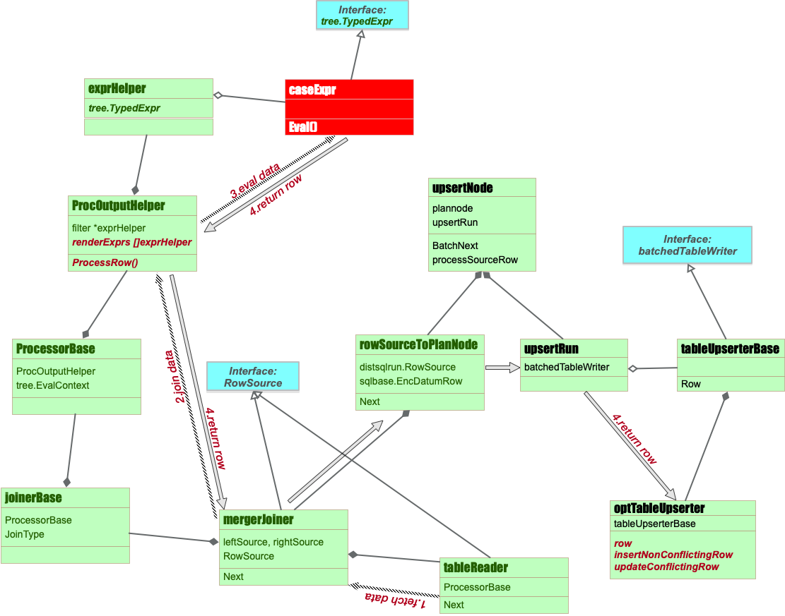
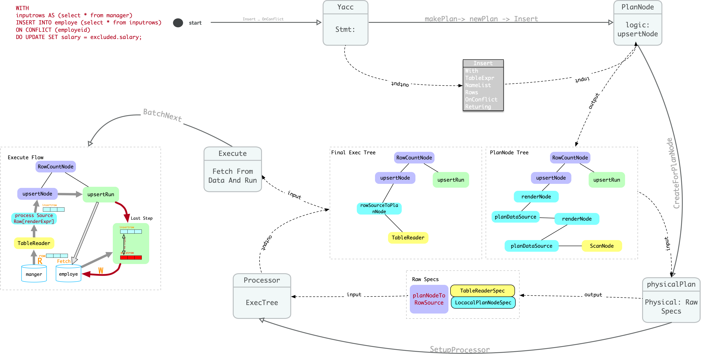
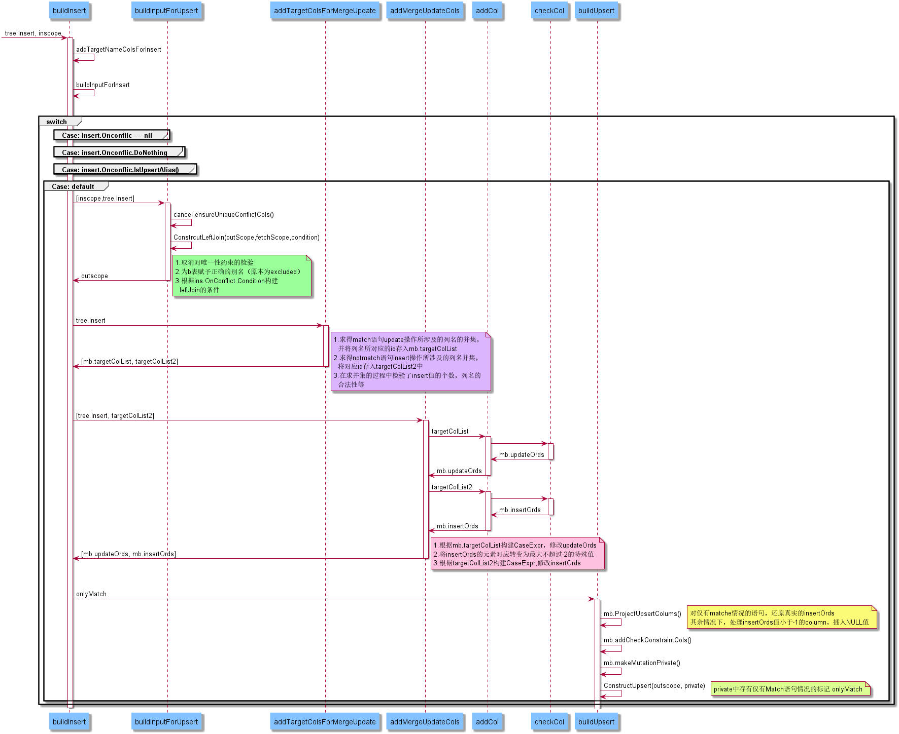
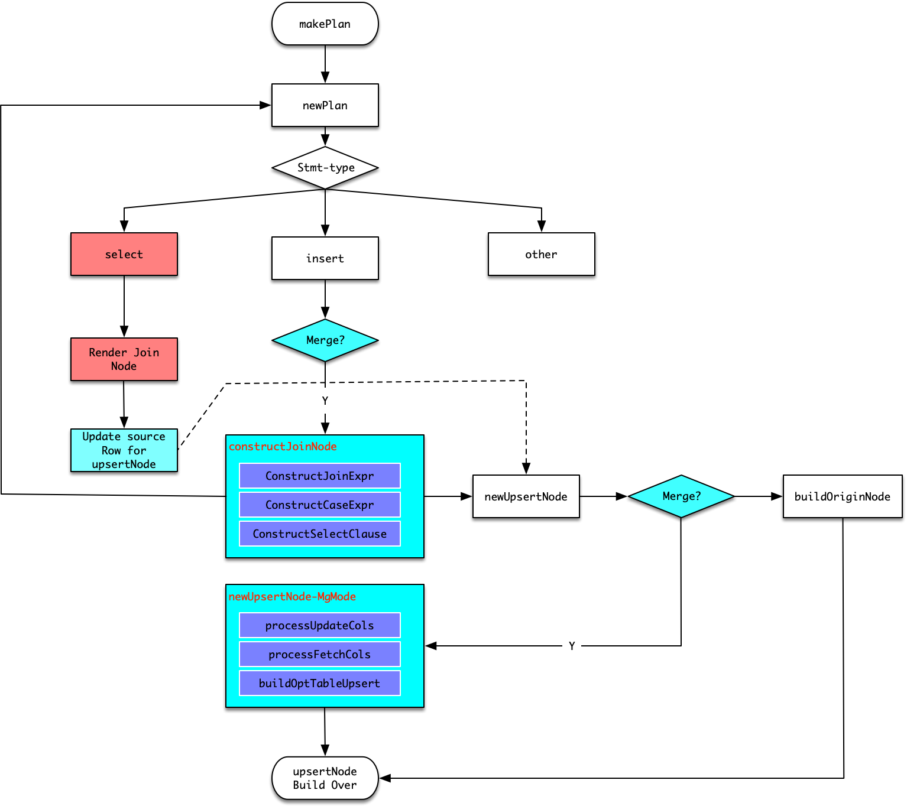

       <font face="impact" size=50 color=#4F5F4F > **MERGE INTO DESIGN DOC**</font>
---

**本文档为兼容DB2/Oracle MergeInto 语法功能， 以供开发和测试人员使用。**

---

### 主要内容:
1. 概要说明。
2. 需求说明。
3. ZNBase Insert OnConflict 模型说明。
4. 概要设计。
5. 详细设计。

### 1.概要说明:

---

- 为了使浪潮分布式数据库ZNBase 兼容DB2和Oracle 等数据库MERGE INTO 功能核心语法，进行本次设计。
- 基于原有Insert OnConflict 功能上进行功能的兼容和开发。
- 以兼容DB2 语法功能为主。在兼容新功能时不影响原有OnConflict 的功能。

### 2.需求说明:

---

- 原有Insert OnConflict 功能：

    1. insert-stmt:

    

    insert stmt 中的OnConflict 源于postgres语法，用于根据某几列进行冲突检测，根据冲突是否存在进行相应处理。

    2. on_conflict:

    

    * conflict 后面为冲突列名的链表：必须为主键列。
    * 列不冲突只能进行 **Insert** 操作， 且插入的数据来源于Insert stmt 语句中的定义。
    * 列冲突可以进行 **Update** 和 **Do nothing** , 其中update 操作可以进行表达式求值和where 条件过滤。

    Example: 
    ```SQL
    CREATE TABLE EMPLOYE (
        EMPLOYEID INT NOT NULL PRIMARY KEY,
        NAME STRING NOT NULL,
        SALARY FLOAT
    );

    INSERT INTO EMPLOYE VALUES 
			(1,'zhangsan',1000),
			(2,'lisi',2000),
			(3,'wangwu',3000),
			(4,'zhaoliu',4000),
			(5,'gaoqi',5000);

    CREATE TABLE MANAGER (
        MANAGERID INT NOT NULL PRIMARY KEY,
        NAME STRING NOT NULL,
        SALARY FLOAT
    );

    INSERT INTO MANAGER VALUES 
			(3,'wangwu',5000),
			(4,'zhaoliu',6000),
			(6,'liuba',7000);

    WITH 
    inputrows AS (select * from manager)
    INSERT INTO employe (select * from inputrows)
    ON CONFLICT (employeid)
    DO UPDATE SET salary = excluded.salary;
    ```
- 待兼容Merge Into 功能（参考IBM DB2语法）：

    

    * **Merge Into** 关键字后面跟的是待merge（Merge 的目标） 表或视图（视图暂不予以支持）。
    * **USING** 关键字后面所跟的是被Merge 或者说是Merge 的源表。
    * **On** 后面所跟即为两个表之间是否match 的条件。该条件不必要求为主键列。且相对灵活。
    * **When ... Then ...** 构成了一组条件和执行语句，即为当满足某个match 条件时， 完成相对于的modification的操作。
    * **Match-condition** 可以分为 **(not) match And search-condition**。

        * match 即为满足On 条件下，再满足 Search-condition 的行只能进行 update 和 delete 操作。
        * not match 即不满足On 条件下， 满足Search-condition 的行只能进行 insert 的操作。
    * **When ... Then ...** 在一个merge stmt 中可以存在多个这样的条件操作语句。如果某一行数据同时满足多个这样的条件，则执行第一个满足条件的操作。
    * **ELSE IGNORE** 则忽略改行数据不进行任何操作。

    DB2 语法细节请参考：

    [*db2-mergeInto-syntax*](https://www.ibm.com/support/knowledgecenter/en/SSEPEK_12.0.0/sqlref/src/tpc/db2z_sql_merge.html)

    以上为本次兼容merge into 语法的基本需求。

---
### 3. ZNBase Insert OnConflict 模型说明:

介于ZNBase 原有模型对于OnConflict的实现在优化开启和关闭的情况下是截然不同的实现，因此分为两部分进行介绍。

#### 3.1 优化开启

现有模型下, insert OnConflict 能够实现merge into 大部分功能，因此本次设计的原则通过深入改造OnConflict的处理逻辑，兼容DB2 merge 语法。因此本节介绍Insert OnConflict的实现模型。

##### 3.1.1 查询计划
首先看现有模型下下面语句的计划：
```SQL
set optimizer = on;
explain WITH 
inputrows AS (select * from manager)
INSERT INTO employe (select * from inputrows)
ON CONFLICT (employeid)
DO UPDATE SET salary = excluded.salary;

plan as:
+---------------------------+----------------+----------------------------------+
| tree                      | field          | description                      |
|---------------------------+----------------+----------------------------------|
| count                     |                |                                  |
|  └── upsert               |                |                                  |
|       │                   | into           | employe(employeid, name, salary) |
|       │                   | strategy       | opt upserter                     |
|       └── render          |                |                                  |
|            └── merge-join |                |                                  |
|                 │         | type           | left outer                       |
|                 │         | equality       | (managerid) = (employeid)        |
|                 │         | mergeJoinOrder | +"(managerid=employeid)"         |
|                 ├── scan  |                |                                  |
|                 │         | table          | manager@primary                  |
|                 │         | spans          | ALL                              |
|                 └── scan  |                |                                  |
|                           | table          | employe@primary                  |
|                           | spans          | ALL                              |
+---------------------------+----------------+----------------------------------+
```
可以简单得出以下几个结论：
1. 整个执行过程可以分为两个阶段，即数据的查询和输出操作（QUERY + DML)。
2. 查询阶段通过join 进行条件匹配的判断，实际上为左外连接，类型为**merge join**。
3. DML 阶段存在upsert 这样的节点进行对join 后的数据进行实际的处理。

##### 3.1.2 执行流程

经过以上分析，结合SQL 各个阶段的核心数据结构，绘制了下面的执行流程图：


- yacc => stmt 阶段： 构建出insert 结构, OnConflict 相关的信息直接挂在Insert 下面。可见OnConflict的操作本质上还是一个insert 的操作。
- 构建Memo 表达式阶段， 系统会根据Insert的逐步的构建出Memo 表达式的树状结构。最终的树状结构参考上图中的Memo Tree。
- 构建PlanNode 的阶段， 通过Memo 表达式进行逻辑计划的构建，在构建逻辑节点的同时还要构建出核心的执行单元upsertRun。最终的数据结构参考上图中的PlanNode Tree。
- 构建process specs， 通过Plannode 进行物理计划specs 的构建。其结果为若干processors 的数组。
- 通过processsors 和原有node 的结合和重构，最终的执行计划为图中的Final Exec Tree。
- 最终根据该计划完成整个执行过程。执行过程参考Execute Flow。
- 执行过程可总结如下。
  1. 通过计划不停从表（数据源）中迭代数据。
  2. 完成merge join 计算。
  3. 根据join 的结果进行表达式计算， 对数据进行求值。
  4. 根据求值结果，构建insert、update 的操作的数据。
  5. 最终完成数据的写入操作。

##### 3.1.3 DML 执行过程
DML执行过程参考下面的时序图。


DML 执行过程参考上图总结如下：

- 整个DML 执行过程驱动来自于upsertNode 的batchNext 方法。
- 每进行一次迭代，都会从两个表中读取数据，在mergerJoiner 的next 方法中进行处理，完成on 条件的join。
- 在mergeJoiner 处理完成后，会对一行join 的row 进行process 处理，这其中就包含关键的表达式求值，即会根据前期构造的表达式，并结合行数据进行最终数据的求值过程。
- 根据计算后的值最终执行相应的DML 操作。核心会根据join 的结果判断是否insert 还是update。具体参考3.4 节介绍。

##### 3.1.4 表达式求值过程
表达式构造流程参考下面的流程图


表达式构造流程参考上图总结如下：

- 根据**2.需求说明**中给出的例子，表达式求值首先将源表(manager)作为左表与目标表(employe)做左连接操作，连接条件为employeid，即employeid=managerid。
- 左连接的结果中，源表列被称为insert cols，用于之后做insert操作；目标表列被称为fetch cols，用于之后做查找比较操作；连接条件employeid被称为canary cols，根据此列判断是否match。
- join操作之后，根据do update时提供的set表达式，构造update cols。
- 最后为每一列构造case表达式。when canarycols==nil then insert else update。当canary cols为空，说明managerid没有match到，对之前构造的insert cols做标记等待insert，如果canary cols不为空，说明match到了，对update cols做标记等待update。

表达式求值中涉及到的结构转换参考下面的类图：


总结如下：

- upsertNode主要包含了两部分，rowSourceToPlanNode生成了upsert的输入参数，upsertRun包含了upsert的具体执行过程。
- rowSourceToPlanNode的RowSource来源于mergeJoiner batchNext到的结果。
- mergeJoiner主要包含了两部分，tableReader对连接表进行遍历获得原始数据，JoinerBase.ProcessorBase.ProcOutputHelper.renderExprs[i].Eval 会根据构建时记录在projection中的表达式对merge结果进一步处理。
- upsertRun主要通过optTableUpserter.InsertNonConflictingRow和optTableUpserter.updateConflictingRow对相应结果进行处理。
- 执行过程可总结如下。
  1. 通过tableReader扫描表读取数据。
  2. 将1中扫描到的数据交给mergeJoiner做join操作。
  3. 通过ProcOutputHelper中renderExprs的Eval接口，调用表达式对merge结果进行处理。
  4. 将上步结果返回给rowSourceToPlanNode并交给upsertRun，由optTableUpserter进行真正的upsert处理

#### 优化关闭

优化关闭后的OnConflict的执行流程:
```SQL
set optimizer = off;
explain WITH 
inputrows AS (select * from manager)
INSERT INTO employe (select * from inputrows)
ON CONFLICT (employeid)
DO UPDATE SET salary = excluded.salary;

plan as:
tree                     |  field    |           description             
+------------------------+----------+----------------------------------+
  count                  |          |                                   
   └── upsert            |          |                                   
        │                | into     | employe(employeid, name, salary)  
        │                | strategy | upserter                          
        └── render       |          |                                   
             └── scan    |          |                                   
                         | table    | manager@primary                   
                         | spans    | ALL         
```
参考下图，优化关闭后的主要执行流程，和之前有较大差异：
1. 直接从stmt 构建 plannode。构建的node 和之前也有较大不同，取消了join node。 
2. upsert 构建过程中对于upsertRun 的核心执行器，从optTableUpserter 变为了tableUpserter。
3. 整体执行流程摒弃了通过join 方法逐行检查冲突，改为分别读取两个表，结束阶段通过主键检查两表主键是否冲突。
4. 非优化情况下，严重依赖主键进行冲突检查。



---

### 4. 概要设计

---
#### 4.1 关键节点匹配
由于原有insert OnConflict 功能和 merge into 功能存在大部分重合点， 且执行计划的过程也符合merge into 应有的执行过程。因此本次方案决定采用在insert OnConflict 为核心的执行计划上进行改造，来实现全部的merge into 的功能。
``` SQL
insert-onconflict:
-----
WITH 
inputrows AS (select * from manager)
INSERT INTO employe (select * from inputrows)
ON CONFLICT (employeid)
DO UPDATE SET salary = excluded.salary;

Merge-into:
MERGE INTO EMPLOYE AS EM
USING MANAGER AS MA
ON EM.EMPLOYEID=MA.MANAGERID
WHEN MATCHED THEN UPDATE SET EM.SALARY=MA.SALARY
WHEN NOT MATCHED THEN INSERT VALUES (MA.MANAGERID,MA.NAME,MA.SALARY);
```


**匹配表格**

No|merge into 语句|irt...cflt 语句|匹配度| 待开发点
-|-|-|-|-
1|mergeinto-tab(employe)|target-tab(employe)| 完全匹配| 无 
2|using-tab(manager)|source-tab[inputrows(manager)]|可以匹配| 无
3|on-condition| conflict-condition| 需要改造，可以实现| 传递全部on 条件，且取消主键约束
4|WHEN ... THEN ...| 冲突update(do-nothing)，否则insert| 单个when then 条件可以完美匹配，多个需要改造|改造多个when ... then 条件
5|WHEN MATCH THEN DELETE| 无| 不能匹配| 需要添加
6|Not atomic continue on exception|无| 不能匹配| 需要添加

#### 4.2 On 条件的匹配

- 原有OnConflict条件对于冲突列有约束，必须为主键，并通过多个列进行on 条件的构建。
- 而对于merge into 匹配条件较为灵活，因此需要将原有OnConflict的 on 条件的构造直接更换为用户自定义的on 条件。
- 另外，由于原有OnConflict 通过唯一性约束的主键列最终构建的是merge join 进行冲突列的检测。而取消约束后，最终构建的join 类型也会更换为hash join。因此更换后的计划会有如下变化。
```SQL
plan as:
+---------------------------+-----------------+----------------------------------+
| tree                      | field            | description                      |
|---------------------------+-----------------+----------------------------------|
| count                     |                 |                                  |
|  └── upsert               |                 |                                  |
|       │                   | into            | employe(employeid, name, salary) |
|       │                   | strategy        | opt upserter                     |
|       └── render          |                 |                                  |
|            └── hash-join  |                 |                                  |
|                 │         | type            | left outer                       |
|                 │         | equality        | (managerid) = (employeid)        |
|                 │         |left cols are key| +"(managerid=employeid)"         |
|                 ├── scan  |                 |                                  |
|                 │         | table           | manager@primary                  |
|                 │         | spans           | ALL                              |
|                 └── scan  |                 |                                  |
|                           | table           | employe@primary                  |
|                           | spans           | ALL                              |
+---------------------------+-----------------+----------------------------------+
```
#### 4.3 多When... then ... 条件匹配

为了兼容多个 when ... then ... 条件的操作，先回顾一下，原有逻辑是如何进行insert/update 处理的。
1. 表达式求值，按照3.4 节所述，原有逻辑在merge joiner 迭代出一行数据后，会在ProcessRow 函数内部进行表达式的求值。
2. 对于merge joiner 而言一行数据应该由下面几个元素构成。

    +--------+-------+--------+--------+-------+

    | Insert | Fetch | Update | Upsert | Check |

    +--------+-------+--------+--------+-------+

    其中上述的每个部分都对应了一个或多个 expHelper, 保存在mergeJoiner => joinbase => processBase => procOutputHelper 的renderExprs里面。而每个expHelper 内部都保存着一个case 表达式。
3. 根据3.4 介绍， 该case 表达式的构成如下图所示：
为了兼容多个when 条件,在原有每个列的caseExpr 上进行改造。根据Match/NotMatch 的condition和operation 为每一个相关列，构造一组 CaseExpr 表达式， 该表达式用以区分不同condition 下的表达式。在表达式求值阶段也会根据不同的condition 从源数据中计算出相应的结果。
``` Go
         CaseExpr
         /      \ 
        /        \ 
      When       else(updateOp)
     /     \      |====> xxxExpr/indexVarExpr 
    /       \
  ==Null   Val(insertOp)
            |====> xxxExpr/indexVarExpr

            ---
            |||            
            |||            
            |||            
           \|||/            
            \|/

        CaseExpr
         /    \___________________________________ 
        /                                         \ 
      When                                         else(Match Operations)
     /     \                                          |====>  CaseExpr
    /       \                                          \___  When cond1 then Expr
  ==Null   Val(NotMatch Operations)                     \___ When cond2 then Expr
            |====> CaseExpr                              \___ When cond3 then Expr
             \___  When cond1 then Expr
              \___ When cond2 then Expr
               \___ When cond3 then Expr

```
#### 4.4 Additional 操作的处理

##### 4.4.1 待实现功能:
经过上面处理后还存在以下几个待处理问题：
1. Match 情况下delete 操作的实现。
2. Signal 进行报错处理的实现。
3. Not Match 不符合条件的行不插入的问题。

为了处理以上几种特殊情况，考虑在原有Merge Join 的输出列下增加一个新的Cols：

    +--------+-------+--------+--------+-------+------------+
    
    | Insert | Fetch | Update | Upsert | Check | Addtional  |
    
    +--------+-------+--------+--------+-------+------------+

该Cols 表达式依然为一个CaseExpr：
里面的when 条件的val 每个都是一个AddtionnalExpr
AddtionalExpr在求值结果中可以是多态的：
其取值范围有以下几种:

- 1: 代表该行记录需要delete
- 2：代表该行符合signal 报错， 返回错误退出。已操作的数据进行回滚操作。
- 3：代表该行记录不符合插入的条件， 不进行插入操作。 
- 4: 代表不做特殊处理。


##### 4.4.2. 报错处理： 兼容DB2 signal-statement语法。

   语法实现参考以下DB2的实现:
   [**DB2 signal statement syntax**](https://www.ibm.com/support/knowledgecenter/en/SSEPEK_12.0.0/sqlref/src/tpc/db2z_signalstatement4nativesqlpl.html) 

#### 4.5 非优化下查询计划调整

由于非优化情况下的实现严重依赖于主键进行冲突检查，考虑修改执行计划。
将非优化的查询计划调整为优化开启的计划。
因此需要解决以下几个问题：

- upsertNode 的source 调整为 joinNode。具体根据 sourceTable, targetTable 两个表和用户指定的on 条件构建joinNode。
- joinNode 的投影列表达式也需要构建多组caseExpr，来处理多组不同when 条件下的求值处理。
- 投影列按照upsertRun 中optTableUpsert 所需要的列进行构建。
  ==>> insertCols || fetchCols || updateCols || matchCols || addtionalCols 
- 最后构建正确的optTableUpsert，放置到upsertRun中。

### 5. 详细设计

#### 5.1 优化下Merge into基本功能的实现

根据需求说明，merge into功能旨在适配DB2中的merge into语法。需要修改或添加的功能包括on条件的匹配，多个when…then...条件匹配以及允许该语法只操作与match或not match所匹配的数据。由于本次方案决定采用在insert OnConflict 为核心的执行计划上进行改造，所以添加以及修改的代码大都在buildInsert也就是构建insert的memo tree这一层，通过mutationBuilder(mb)构建scope，继而构建UpsertExpr，然后执行计划完成DML部分。



- 由于merge into的语法是基于insert on conflict实现，因此先在tree.insert.OnConflict中添加了两条属性，MatchList和NotMatchList,其分别存储merge into语句中的when match和when not match部分（包括condition以及Operation）。
- 与merge into语句匹配的代码在switch case的default部分。buildInputforUpsert方法负责使用冲突列作为连接条件，将每个输入行左连接到目标表。此处修改如下：
  1. 取消对唯一性约束的检查。
  2. 为源表赋予正确的别名而不是固定的excluded。
  3. 根据on condition构建真正的连接条件，相对灵活，而不是固定列名。
- AddTargetColsForMergeUpdate方法负责获得将要从SET表达式更新的列。此处做了适当修改，由于merge into语法支持多个when...then…操作,为使更新的列不会重复，在此处分别求得match语句update操作所涉及的列名的并集，将列的ColumnID存入mb.targetColList。同理将相应的not match的列名并集ID存入targetColList2；并在求并集的过程中检验了insert值的个数，列名的合法性等等，防止出现空指针以及列名不对应等情况。
- addMergeUpdateCols方法负责通过列信息构建每一句set表达式。这里由于修改了caseExpr的结构，因此同样通过之前得到的insert列的信息将insert表达式也构建出来。在构建match情况的caseExpr时，需遍历之前得到的存有update操作所涉及的列名的并集targetColList，为每一列找出所有与之相关的when…match…操作，并将这些condition以及operation存入caseExpr的Whens属性中。每一列构建一个caseExpr，然后通过addCol方法存入mb，同时修改mb中的updateOrds。构建not match的caseExpr同理。在notMatch语句中，没有被Insert涉及的列所对应的insertOrd在经过该函数后，将被修改成不大于-2的特殊值。
- buildUpsert方法负责构造最终的upsert statement。修改ProjectUpsertColums方法，根据接收到的onlyMatch和onlyDelete的值区分merge语句的不同情况，当同时存在match与notMatch语句或者仅有notMatched时，为insertOrd不大于-2的列赋值为NULL，满足条件的列插入NULL值；如果仅有match语句，则还原insertOrd为原有的值，避免影响后续流程；如果仅有delete情况，为能够将符合条件的row的数值成功传到执行阶段以用于删除操作，修改updateOrd的值为fetchOrd。在buildUpsert方法中，构建UpsertExpr时需要一个名为MutationPrivate的结构，在此结构中添加了一个布尔值，用来判定该merge into语句是否只有match操作而没有not match操作。首先在statement.opt文件中的mutationPrivate结构中添加该布尔属性，通过make build编译成功之后，便可在buildUpsert方法中通过判定修改该布尔值。在最终执行阶段，程序可以通过该布尔值轻松判断是否需要执行insert操作。

#### 5.2 AddtioanalExpr 以及相关列的构建:

参考4.4 节， 为了方便在后面执行阶段区分delete, not insert, 和 signal 等多种额外的操作，需要添加新的列在输出的投影列里面。
参照原有的canaryCol属性，在适当位置添加相关属性，包括statement.opt中的mutationPrivate，UpsertExpr，MutationCols，**mutationBuilder**等。该列从优化阶段一直传递到执行，需要在merge join 结束后构建的一行数据里面包含该列的值。
而对于该列的表达式应该是包含了若干个AddtionalExpr的CaseExpr, 其中AddtionalExpr 表达式定义如下：
``` Go
type AddtionalExpr strcut {
    Expr
    type int /* three mode 1: delete op. 2: signal op. 3: not insert op. */
    sqlstate string /* sig relate */
    sqlmsg string /* sig relate */
}
```
在构造该列的CaseExpr 的时候，应该遍历所有MatchList，NotMatchList 来填充相关的数据结构。最终构建的CaseExpr 应该如下所示：
``` SQL
        CaseExpr
         /    \___________________________________ 
        /                                         \ 
      When                                         else(Match Operations)
     /     \                                          |====>  CaseExpr
    /       \                                          \___  When cond1 then AddtionalExpr  // signal op
  ==Null   Val(NotMatch Operations)                     \___ else  AddtionalExpr // default do nothing
             \
            CaseExpr
            /       \
          /          else  AddtionalExpr // default do nothing
        /
        \ when con1 then AddtionlExpr // signal op
         \ when con2 then AddtionlExpr // not insert op
```

#### 5.2 Addtion 操作的执行

##### 5.2.1 delete 操作
Merge Delete 功能仅适用于WHEN MATCHED情况下，用于删除原表中符合条件的数据。其实现如下：

- yacc层实现，当识别到DELETE关键字，则matchList中当前match下的isDelete属性则为TRUE，方便后续判断。
- merge语句中的update和insert，其执行阶段是通过构建row.updater和row.inserter实现的，同理，为实现merge delete，则需要调用row.deleter。
- 在addMergeUpdateCols方法中，当识别到该match需要执行delete操作，增加AddtionCols 列中When...条件，标记为delete op。
- 在执行阶段检查Addtion 列的值，若检查到为delete 操作，则进行delete 删除操作。

##### 5.2.2 Sig报错操作

- yacc层实现， 将相关的报错信息写入stmt 结构中。
- 在addMergeUpdateCols方法中，当识别到该match需要执行Sig操作，增加AddtionCols 列中When...条件，标记为Sig op, 并将报错信息传入AddtionalExpr 中。
- 在执行阶段求值中若检查到为Sig 操作的时候，直接利用表达式的报错信息报错退出。

##### 5.2.3 not insert 操作

not insert 比较特殊，是为了解决not match 条件下，对于不满足and 后面的若干子条件，不进行插入的问题。
- 在addMergeUpdateCols方法中， 需要依据所有的Not Match 的子条件，构造反向条件，即所有insert 的条件都不满足时，标记为not insert op。
- 在执行阶段若检查到not insert 操作的时候，不进行插入。

#### 5.3 非优化计划的改写和详细实现:



参考上述流程图，详细设计如下所示：
1. 在newPlan 阶段的Insert 部分，构建UpsertNode 之前，首先判断是否merge stmt。
2. 若为merge stmt 构建JoinNode， 其中包括对Join 表达式构建， Case表达式构建， 最终构建为一个SelectClause。
    其中投影列的构造顺序与优化的顺序相同
    ==>> insertCols || fetchCols || updateCols || matchCols || addtionalCols 
   其等价语句如下
   ``` SQL
   select 
   case when em.employeid = null then managerid else  employeid end,
   case when em.employeid = null then ma.name else em.name end,
   case when em.employeid = null then 
        case when ma.salary > 1000 then ma.salary *0.5 
        else ma.salary end else  em.salary end,
        ... 
    from manager ma
        left outer join employe em  
    on  ma.managerid = em.employeid;
   ```
3. 将构建上面Select（join）表达式构建的节点传入到newUpsertNode 里面。
4. 在newUpsertNode 里面判断是否merge 后，构建新的upsertNode， 其中最重要的即为构建OptTableUpsert。
5. 返回upsertNode。
6. 后续执行阶段就回退到优化流程中。