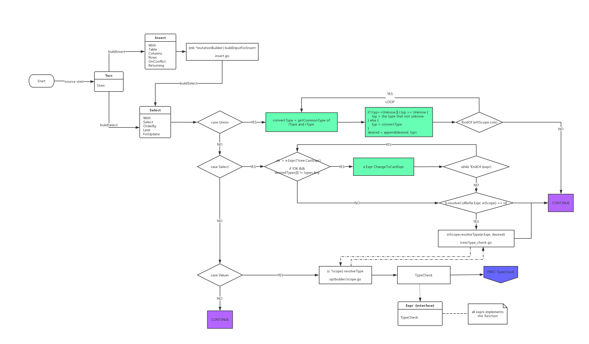
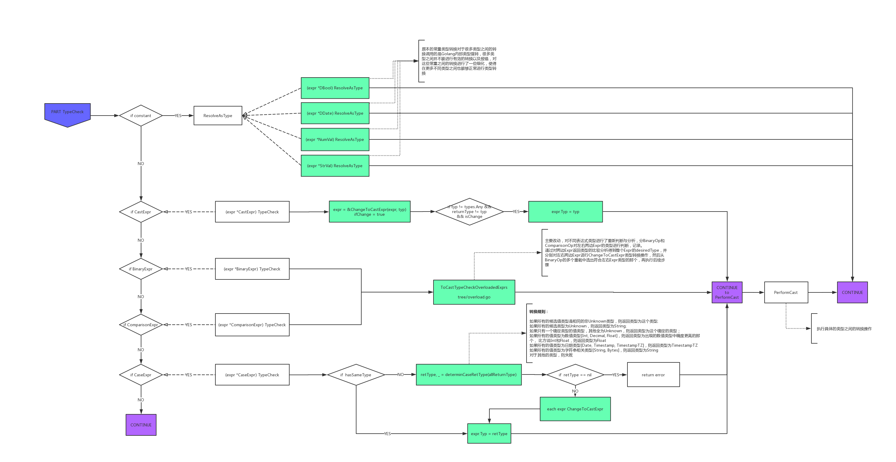

### 主要内容:
1. 概要说明。
2. 需求说明。
3. Cockroach Summer 类型系统简述
4. 概要设计。
5. 详细设计。

### 1. 概要说明

---
- 为了使浪潮分布式数据库ZNBase兼容DB2和Oracle等数据库的隐式类型转换功能，进行本次设计。
- 基于Cockroach原有的类型系统进行开发
- 主要目标是覆盖Mysql的隐式类型转换，DB2的隐式类型转换基本是Mysql的子集。
### 2. 需求说明

---
- CockroachDB 目前支持的隐式类型mysql转换：

  |               | To  | To   | To    | To       | To     | To      | To   | To        |
  |---------------|-----|------|-------|----------|--------|---------|------|-----------|
  |               | Int | Date | Float | Interval | String | Decimal | Bool | Timestamp |
  | **Int**       | ——  | X    | √     | X        | X      | √       | X    | X         |
  | **Date**      | X   | ——   | X     | X        | X      | X       | X    | X         |
  | **Float**     | X   | X    | ——    | X        | X      | X       | X    | X         |
  | **Interval**  | X   | X    | X     | ——       | X      | X       | X    | X         |
  | **String**    | √   | √    | √     | √        | ——     | √       | √    | √         |
  | **Decimal**   | X   | X    | X     | X        | X      | ——      | X    | X         |
  | **Bool**      | X   | X    | X     | X        | X      | X       | ——   | X         |
  | **Timestamp** | X   | X    | X     | X        | X      | X       | X    | ——        |
  
- 待支持的Mysql隐式类型转换：

  |               | To  | To   | To    | To   | To      | To   | To        |
  |---------------|-----|------|-------|------|---------|------|-----------|
  |               | Int | Date | Float | Text | Decimal | Bool | Timestamp |
  | **Int**       | ——  | √    | √     | √    | √       | √    | √         |
  | **Date**      | √   | ——   | √     | √    | √       | X    | √         |
  | **Float**     | √   | √    | ——    | √    | √       | √    | X         |
  | **Text**      | √   | √    | √     | ——   | √       | √    | √         |
  | **Decimal**   | √   | X    | √     | √    | ——      | √    | X         |
  | **Bool**      | √   | X    | √     | √    | √       | ——   | X         |
  | **Timestamp** | √   | √    | √     | √    | √       | √    | ——        |

- 具体需求：
  1. 支持数值类型之间的隐式转换
     - 低精度转高精度：原本支持
     - 高精度转低精度：四舍五入
  2. 字符串转数值: 到第一个不能转换为数值类型的位置截断，'\\'+数字视为十进制数字，支持浮点数，负数，科学记数法。
  3. 字符串转date:
  
     输入2位以下整数：报错。
  
     输入3到4位的整数：右端对齐，月份高位补零，默认年份是2000年。
  
     输入5位整数：第一位表示年份，即200X年，后四位表示月日。
  
     输入6位整数：根据前两位的数值确定默认年份，后四位为月日。前两位大于等于70视为19XX年，小于70视为20XX年。
  
     输入7位整数：前三位为年份，即0XXX年，后四位为月日。
  
     输入8位整数：完整的年月日。
  
     输入8位以上的整数，需求定为报错。
  
     以上规则从第一个不是0的数字算起
  4. 数值类型转date: 值为整数的数值类型先转为string再转int
  5. 转timestamp: 和转date类似。当年月日完全指定时才能指定时分秒。
  6. bool相关: 零值和负值视为false，其他值视为true
  7. Union相关: 有字符型则转换为字符型，数值类型之间转换为高精度，数值和时间之间转换为字符型
  8. Join相关: On条件支持隐式类型转换
  9. 其他类型转字符串: 直接转换为字面值的字符串
### 3. Cockroach Summer 类型系统简述

---
本次方案是在Cockroach原本的类型系统Summer的基础上设计的，本小节介绍Summer系统的类型检查过程中与本方案有关的部分。
#### 3.1 递归的类型检查
Cockroach在makeExecPlan阶段完成对类型的处理，分为三步：占位符注释，常量折叠和语法树递归遍历。其中第三步是本方案所重点关注的。在前两部结束后，我们得到了一颗语法树，其每一个节点均为Expr接口类型。对语法树进行递归类型检查的函数接受两个参数：要处理的节点和所需类型desired type, 该函数将调用节点的Expr.TypeCheck()方法。TypeCheck方法返回一个TypedExpr接口类型，它能够返回(无需再次检查)它在求值时将返回的类型。依据节点类型的不同，TypeCheck方法的工作方式也不同：
- 若节点已被解析过，则忽略。
- 如果节点类型是列的引用或者datum(基本的数据类型，如DInt，DString)类型，则按照节点本身的类型去处理，忽略传入的desired type。
- 如果节点类型是常量(Constant接口类型)，则先获取该常量的可解析类型集合。若desired type存在且在该类型集中，则将常量转换为对应的Datum类型，否则转换为该常量的自然类型,一般是可解析集合中的第一个。常量类型有NumVal和String两种，其中，StrVal作为String时可以处理为任意类型，而NumVal视其字面值的不同，拥有不同的可解析类型集合，例如：
 
  **Numeric Constant Examples**

  | Value                        | resolvable type set                                                   |
  |------------------------------|-----------------------------------------------------------------------|
  | 1                            | [int,float,decimal]                                                   |
  | 1.0                          | [float,int,decimal]                                                   |
  | 1.1                          | [float,decimal]                                                       |
  | NULL                         | [null,int,float,decimal,string,bytes...]                              |
  | 123..overflowint..4567       | [decimal,float]                                                       |
  | 12..overflowint..567         | [decimal]                                                             |
  | 1/2                          | [float,decimal]                                                       |
  | 1/3                          | [float,decimal]//perhaps future feature:[fractional,float,decimal]    |

- 如果节点是占位符，若desired type未完全确定，则报错。若完全确定，并且尚未为占位符分配类型，则将所需类型分配给占位符。如果已为占位符分配了其他类型，则报错。desired type一般来自上层的传递或本层其他Expr节点的约束。
- 若节点带有子Expr表达式节点或子Select语句节点，则根据节点的特性将desired type向下传播，调用子Expr或子Select语句中包含的Expr的的TypeCheck方法，然后检查递归返回时的情况，并检查得到的类型是否与语义兼容。
- 若节点是带有同质性要求的表达式(如带重载的运算符或Cast语句)或可变参数的函数调用，还需要额外判断相应的规则。对于包含重载运算符的表达式(包括BinaryExpr、 ComparisonExpr和UnaryExpr)，还需要执行重载解析(见下文)，这也是本设计所需要重点关注的.
#### 3.2 重载解析
处理包含重载运算符的表达式和函数调用类似，需要从多个同名的重载中选择一种。比如相加表达式，'+'运算符的重载有20个，包括int + int = int, int + float = float, float + int = float 等等。
这个解析过程是由多个步骤的条件筛选构成的，逐步排除不满足条件的重载。
重载解析在typeCheckOverloadedExpr函数中实现。它接收返回值的desired type，表达式的一系列重载和表达式的参数列表，然后将参数分为三类：

- 常量(const)
- 可变参数(resolvable)
- 占位符(placeholder)

本小节主要介绍和本次设计关系较大的重载筛选步骤。


- 根据常量参数的可解析类型集来过滤候选的重载对于每一个常量参数，若某个重载的对应参数位置的类型不满足该常量的任何一个可解析类型，则过滤掉该重载。

  例子：
  ```sql
  SELECT 2.5 + 3;
  ```
  候选的‘+’运算符的重载有许多，其输入参数是(int,int)、(float,float)、(decimal,decimal)、(string, string)等。对于参数2.5，其类型常量是NumVal，根据字面值2.5，得到其可解析类型集合是{float，decimal, int}。和每个候选重载的第一个参数对比，淘汰掉包括(string, string)在内的一些重载，仅保留第一个参数是float、decimal和int的重载。
- 根据提供的返回值类型过滤重载。若传入了desired type，则过滤掉所有返回类型和desired type不同的重载。
- 根据可变参数TypeCheck后的类型进行过滤。对于可变参数，先进行TypeCheck，然后获取其类型，随后和候选重载的对应位置参数类型对比(和常量参数的步骤类似)， 过滤掉不满足的重载。
   
#### 3.3 对子表达式的类型有额外要求的表达式

一些表达式对其子表达式的类型有额外要求，比如需要子式的类型全部相同。如case表达式，在CASE(条件) WHEN(条件) THEN(值) ELSE(值) END中，要求条件和条件类型相同，值和值类型相同。对于这类类型检查，如果存在着可以获取类型的子表达式节点，则获取其类型，并用这个类型解析所有应该和该子表达式节点类型相同的子表达式节点。若多个可获取类型的子节点产生了矛盾，则报错。
### 4. 概要设计

---
本次方案决定在原本的类型系统Summer的基础上实现隐式类型转换。
### 4.1 应用场景和修改方法
本方案需要在多种场景下上实现隐式类型转换，针对不同场景需要对不同类型的Expr的TypeCheck方法进行分别修改。。
- 直接输入字面值时，输入的字面值被解析为常量表达式，如
  ```sql
  select 1 + '1.2';
  ```
  中，1被解析为NumVal，　'1.2'被解析为StrVal。对于这种常量表达式，本方案扩充其可解析类型集，并修改或添加其转换到每个其他类型的具体规则。
- 带运算符的表达式需要重载解析，如
  ```sql
  select (1 + '1.2') = 2.2;
  ```
  的加号和等号表达式被分别解析为BinaryExpr和ComparsionExpr。针对这类有重载的运算符，本方案在重载解析之前先确认左右两个参数的类型，根据它们找出预定义的目标类型，将参数全部转换为这个类型再执行后续的重载解析。具体的转换方式是构建Cast结构，用原本的Cast功能完成表达式的类型转换。
- 对于其他各种Expr，如表示某表中某一行数据及其索引的IndexedVal，表示个case结构的CaseExpr等，如果其涉及到隐式类型转换，就需要对其TyoeCheck方法进行定制化的修改。
- Union语句，本方案将Union结构中左右两端的Select结构的类型统一(根据两端的类型决定统一后的类型)。并针对优化开启和优化关闭两种情况分别处理。
- Join语句， 其On条件部分涉及到的隐式类型转换随着重载解析的修改而一并解决。
### 4.2 基本类型和修改位置
基本类型之间的具体转换规则涉及到舍入，科学计数法和日期时间的转换规则等，需要在以下两个位置按照需求逐个修改。
- 相应常量的ResloveAsType方法：这里是常量表达式的TypeCheck方法最终实现类型转换的地方，本方案在该位置修改或添加了符合需求的基本类型转换规则。
- performCast函数。至于常量表达式以外的表达式，本方案使用构建Cast的方式实现类型转换，并在实际实现类型转换的performCast函数处进行和上一条中相似的添加和修改。
### 5. 详细设计

---

#### 5.1 整体流程图

流程图1：


流程图2：


#### 5.2 Constant的处理
- 修改NumVal的可解析类型集合(即AvailableTypes方法的返回值)以允许数值常量转换成其他类型。现在，无论字面量是什么，NumVal的AvailableTypes永远是
  ```GO
  {types.Decimal, types.Float, types.Int, types.OId, types.Date, types.TImestamp, types.TimestampTZ, types.Bool, types.String}
  ```
  相应的，在NumVal的ResloveAsType方法中补充和修改了转换成各个类型的具体实现。
  - 增添了NumVal转换成string, date, timestamp和bool的case分支
  - 修改了NumVal转换成int的规则，先转换成flaot，再进行四舍五入。
- StrVal本就支持转换成任何类型，按照需求的转换规则修改ResloveAsType方法中的具体实现即可。
  - 修改ParseDFloat函数，使其支持科学计数法和截取直到第一个非数字字符。
  - 对于转换成decimal，首先尝试直接转换，出错则调用ParseDFloat，再转换成decimal。
- 为了处理直接输入日期和bool常量而需要隐式类型转换的场景，为date和bool实现了Constant接口， 定义了它们可以转换成的类型，和向其他类型的转换规则(和5.5中对performCast的处理相同)；修改了DDate和DBool的TypeCheck函数，调用TypeCheckConstant。
#### 5.3 OperatorExpr的处理
修改重载解析阶段，将原本的typeCheckOverLoadedExpr函数修改为ToCastTypeCheckOverLoadedExpr函数，增加传入参数opKind来区分运算符表达式的类型，在原本的过滤步骤前增加额外的步骤：
- 对常量参数，记录它们的类型
  1. NumVal：根据其数值，按int或decimal处理
  2. StrVal： 按照String处理
  3. Datum：按照原本的类型处理
- 对可变参数，先将它们TypeCheck成临时的TypedExpr，获取并记录其类型。
- 调用函数GetBinType()或GetCmpType()，根据左右两个参数的类型确定目标类型，并调用ChangeToCastExpr()函数将上述所有参数包装成CastExpr,转换为目标类型.
  
  CastExpr的结构是：
  ```
  type CastExpr struct {
  	Expr Expr
  	Type coltypes.CastTargetType
  
  	typeAnnotation
  	SyntaxMode castSyntaxMode
  }
  ```
  具体的包装过程是：将原表达式写入CastExpr.Expr, 将目标类型写入typeAnnotation, 调用DatumTypeToColumnType()函数将类型为types.T的目标类型转换为对应的coltypes.T类型并写入CastExpr.Type, 最后用新构建的CastExpr代替Expr.转换后，常量参数均变为可变参数，更新相应的参数数组。
- 确认ComparisonExpr参数目标类型的具体规则是

  |               | Int       | Float     | Decimal   | Bool | String    | Date      | Timestamp |
  |---------------|-----------|-----------|-----------|------|-----------|-----------|-----------|
  | **Int**       | Int       | Float     | Decimal   | Bool | Decimal   | Date      | Timestamp |
  | **Float**     | Float     | Float     | Decimal   | Bool | Decimal   | Date      | Timestamp |
  | **Decimal**   | Decimal   | Decimal   | Decimal   | Bool | Decimal   | Date      | Timestamp |
  | **Bool**      | Bool      | Bool      | Bool      | Bool | Bool      | Bool      | Bool      |
  | **String**    | Decimal   | Decimal   | Decimal   | Bool | String    | Date      | Timestamp |
  | **Date**      | Date      | Date      | Date      | Bool | Date      | Date      | Timestamp |
  | **Timestamp** | Timestamp | Timestamp | Timestamp | Bool | Timestamp | Timestamp | Timestamp |
- 确认BinaryExpr参数目标类型的具体规则是

  |               | Int     | Float   | Decimal | Bool    | String  | Date    | Timestamp |
  |---------------|---------|---------|---------|---------|---------|---------|-----------|
  | **Int**       | Int     | Float   | Decimal | Int     | Decimal | Int     | Int       |
  | **Float**     | Float   | Float   | Decimal | Float   | Decimal | Float   | Float     |
  | **Decimal**   | Decimal | Decimal | Decimal | Decimal | Decimal | Decimal | Decimal   |
  | **Bool**      | Int     | Float   | Decimal | Int     | Decimal | Int     | Int       |
  | **String**    | Decimal | Decimal | Decimal | Decimal | Decimal | Decimal | Decimal   |
  | **Date**      | Int     | Float   | Decimal | Int     | Decimal | Int     | Int       |
  | **Timestamp** | Int     | Float   | Decimal | Int     | Decimal | Int     | Int       |
#### 5.4 一般非Constant的Expr的处理
对于常量和运算符以外的大部分表达式，如SelectExpr.Expr, IndexedVal等，调用ChangeToCastExpr()函数将其包装成CastExpr(转换目标是desired type)，再进行TypeCheck。对于表达式数组，按照对应的desired数组分别处理。
#### 5.5 CaseExpr的处理
ZNBase中对于CaseExpr的类型要求是，整个表达式中，case和when的条件类型要一致；除了条件类型之外，每一个when的值类型以及else的值类型也要确保一致，否则就会报错。
对CaseExpr的处理中，原有的对条件类型的判断逻辑保持不变，即所有的条件类型还是需要有相同的类型。  
主要是对CaseExpr中when的值类型做了相关的处理，依据的原则如下，
> - 如果所有的候选值类型是相同的非Unknown类型，则返回类型为这个类型;  
> - 如果所有的候选类型为Unknown，则返回类型为String;
> - 如果只有一个确定类型的值类型，其他全为Unknown，则返回类型为这个确定的类型；
> - 如果所有的值类型为数值类型[Int, Decimal, Float]，则返回类型为出现的数值类型中精度更高的那个，
比方说Int和Float，则返回类型为Float
> - 如果所有的值类型为日期类型[Date, Time, Timestamp, TimestampTZ]，则返回类型为Timestamp
> - 如果所有的值类型为字符串相关类型[String, Bytes]，则返回类型为String
> - 对于其他的类型，则失败  

对所有的值类型进行类型相同检查TypeCheckSameTypedExprs，为了让CaseExpr的类型检查不中途退出，
给函数TypeCheckSameTypedExprs添加了一个isCase参数，在isCase为true时，对函数过程中遇到的错误只记录，不立即抛出；
isCase为false时，执行流程不变。  
在执行TypeCheckSameTypedExprs后，如果发现类型不全相同，则通过determinCaseRetType进行上述规则所述的返回类型判断。
对之前得到的typedExprs执行ChangeToCastExpr转为CastExpr，通过CastExpr达到类型转换的目的。


#### 5.6 CastExpr的处理
CastExpr的处理包括两方面，第一是要求desired type的CastExpr的处理，第二是执行阶段PerformCast()函数的改造。
- 原本的类型系统中，CastExpr的TypeCheck函数不接收desired type，而在本方案中，需要将其他表达式包装成CastExpr再进行TypeCheck等处理，其原本的desired type不能丢失。本方案选择将CastExpr再包装上一层CastExpr，并做标记以避免死循环。
- 在WalkPlan时，PerformCast函数负责进行类型转换工作，通过二重switch-case结构定义了不同类型的Datum两两之间的转换规则。本方案依据需求对部分规则进行了修改。
  1. String转int、float和Decimal：支持科学计数法，转int时默认四舍五入，非纯数字字符串转数值时取第一个非数字字符之前的部分(正负号、科学计数法等例外)。
  2. float和Decimal转int: 由向下取整改为四舍五入。
  3. 时间类型(date和timestamp)相关：
  - int转date：Cockroach原本的类型系统将int视为从一个特定时间开始的秒数。根据需求，本方案改为将int的字面值转换为date，也就是先将int转换为string再转换为date.
  - int转timestamp: 和int转date的处理方法相同。
  - string转timestamp: 原本的类型系统中，如果要同时指定年月日和时分秒，二者之间必须有空格。比如'20191128 123000'的转换结果是2019-11-28 12:30:00,但'20191128123000'无法转换，会报错。本方案修改了这一点，在转换前进行识别并手动添加了空格，使得二者的结果相同
  - float、decimal转date、timestamp: 当float、decimal小数部分为零时，按照整形处理。
  - date、timestamp转数值类型: 同上，由按照相对开始时间的秒数处理改为按照字面处理。
  - bool类型和其他类型相互转换: 零值和数值类型的负值视为false, 其他值视为true。 
#### 5.7 Union的处理
分为优化开启时和优化关闭时。
- 优化开启时：修改语义解析阶段的BuildUnion函数。输入的UnionClause包含左右两个Select类型，本方案修改了原本的BuildSelect和类型检查步骤。先对左右两端分别进行BuildSelect获取其自然类型，然后得出Union后的类型(每一对类型Union后的新类型在GetUnionType函数中分别指定)，最后对左右的Select重新BuildSelect，把上一步得出的类型当作desired type传入。
- 优化关闭时：在newUnionNode函数中直接修改plannode， 用和优化开启时同样的方法得出Union类型，然后将UnionNode中左右两个plannode里的表达式包装成该类型的CastExpr，再更新UnionNode中的一些类型相关的属性。
#### 5.8 Join的处理
Join语句主要在on条件处涉及到隐式类型转换，其本质上是ComparisonExpr。ComparisonExpr的重载解析修改同时实现了Jion语句On条件的隐式类型转换。
