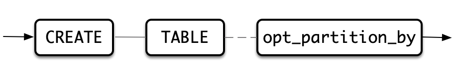
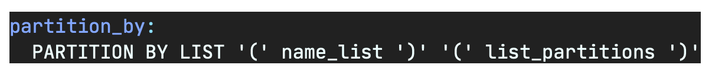
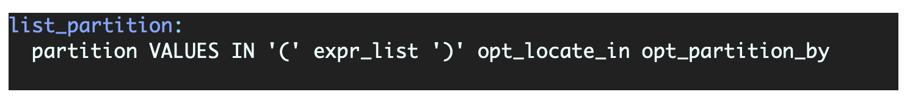
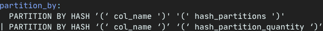
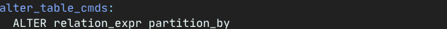
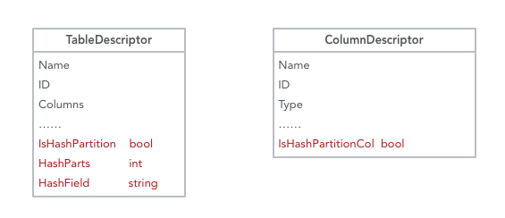
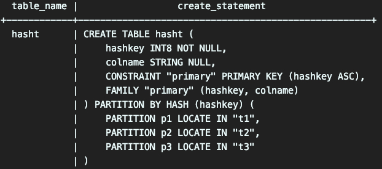
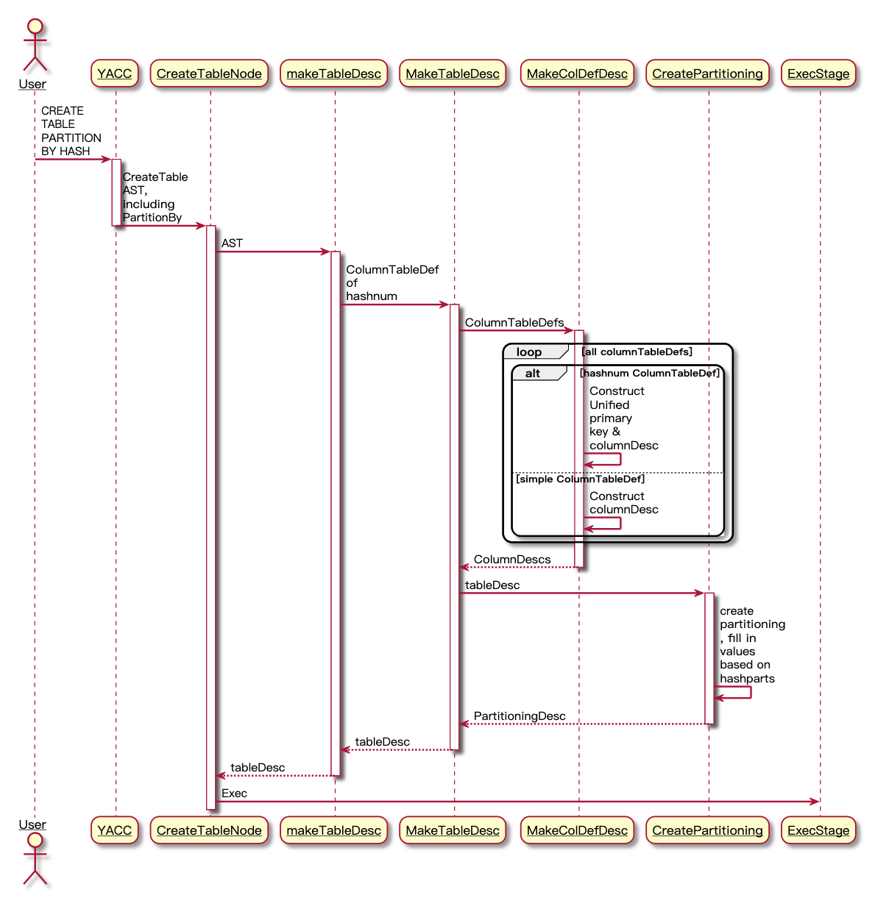
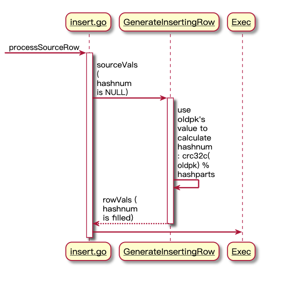
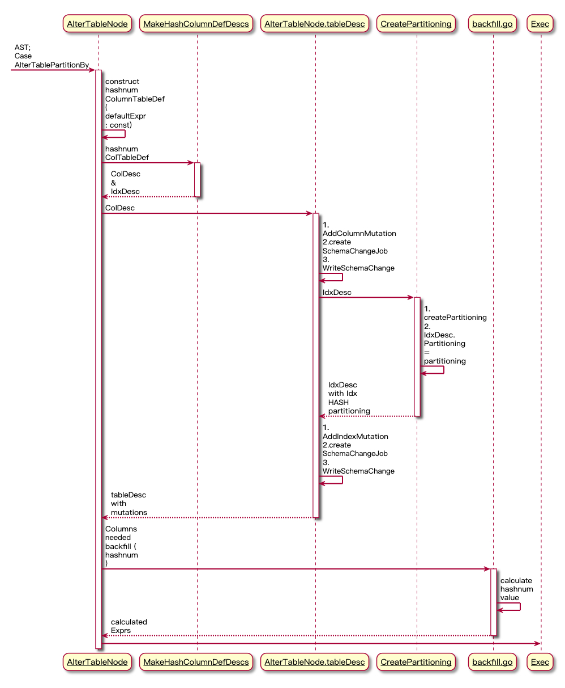

# **HASH PARTITION DESIGN DOC**

----

本文档为兼容Oracle哈希分区语法功能，以供开发和测试人员使用。

----

### **主要内容：**

1. 概要说明
2. 需求说明
3. 概要设计
4. 详细设计

----

#### **1. 概要说明**

- 为了使浪潮云溪数据库兼容ORACLE等数据库哈希分区功能核心语法，进行本次设计。
- 基于先前开发的List分区功能上进行兼容和开发。
- 以兼容ORACLE语法功能为主，在兼容新功能的同时不影响原有分区功能。
- 支持ORACLE不支持的将普通表变为哈希分区表的功能。

----

#### **2. 需求说明**

- ##### 现有LIST分区功能：

列表分区需指定某列的某些值落在某个分区中，该表须有主键。

- ##### 待兼容哈希分区语法及功能：

​	a. col_name为用作哈希分区的列名（一列），必须为主键列.

​	b. hash_partition不需要指定列的值，只需给定partition名称.

​	c. 向哈希分区表进行insert和update操作（主键列）应自动更新分区信息.

​	d. 支持ALTER TABLE PARTITION BY HASH语法，将普通表转为哈希分区表，前提是该普通表有主键列。完成分区的同时源表中的数据不会丢失，并且会进行哈希分区。

----

#### **3. 概要设计**

- ##### 创建LIST分区表实现流程：

  通过yacc层中的partition_by信息构建tree.CreateTable，在构建create table计划节点时使用desc.PrimaryIndex等信息构建分区，继而完成执行。

- ##### 基于创建LIST分区表实现创建HASH分区表思路：

  由于从零开始实现HASH分区表需要改动较多底层算法，因此选择基于LIST分区来实现HASH分区。

  当用户在创建HASH分区表时，向该表添加一列名为‘hashnum’的隐式列，使用该列和原有的主键列做成联合主键来保证主键约束，并通过联合主键构建分区。应使用hashnum列替换原有的主键列作为HASH分区列，hashnum列的值通过使用CRC32函数计算原有主键列的哈希值，并通过取哈希分区数目的模（ 例如p1,p2,p3，三个分区则crc32(pk) % 3 ) 来计算hashnum列的值。最后通过hashnum来做LIST分区，达到数据均匀分区的目的。

- ##### INSERT, UPDATE分区表实现hashnum列自动重计算重分区：

  - INSERT

    通过在INSERT执行阶段判断该表是否为哈希分区表，是的话则根据原有主键列的值计算hashnum列，填充hashnum列的值。

  - UPDATE

    在构建UPDATE节点时，判断是否为哈希分区表，是的话则将hashnum列添加进应该更新的列中，计算sourceValue，完成执行。

- ##### ALTER TABLE PARTITION BY HASH

  - 创建HASH分区

    若判断为PARTITION BY HASH操作，自定义hashnum列的ColumnTableDef，其DefaultExpr属性定义为一个常量，用于之后的列值回填。使用hashnum列的ColumnTableDef生成其ColumnDesc及其索引。通过创建SchemaChange Job和WriteSchemaChange将hashnum这一列落实到TableDesc中。最后再使用hashnum列生成的索引来创建分区，实现通过hashnum索引进行分区。

  - 数据回填

    如若普通表中原本就有数据，那么在进行哈希分区时需要计算原有数据的hashnum列的值。实现手段为使用columnDesc中的defaultExpr，在SchemaChanger调用BackFill时，通过表达式计算算出hashnum列的正确值，进行回填。

----

#### **4. 详细设计  (*以举例形式说明)**

- ##### CREATE TABLE PARTITION BY HASH

  **SQL**: *Create table hasht(hashkey int primary key, colname string) partition by HASH(hashkey)(*

  ​			 *partition p1 locate in t1,*

  ​			 *partition p2 locate in t2,*

  ​			 *partition p3 locate in t3*

  ​		 *);*

  ​		 *show create table hasht;*

  ​		 

  

  - 添加yacc语法，create_table.go: makeTableDesc()中 增添hashnum列的ColumnTableDef。
  - create_table.go: MakeTableDesc()中，遍历所有ColumnTableDef，构建ColumnDefDesc，当遍历到本表的主键列时，构建一个联合主键(hashnum，<原来的主键列>），将原本用户定义的partition列也就是主键列换为hashnum。然后通过联合主键createPartition。通过分区数来定义list分区的值。
  - 修改show create；在hash分区表下不能创建名为hashnum的列。

- **INSERT分区表实现hashnum重计算重分区**

  **SQL:** *insert into hasht values (1,'1'), (2,'2');*

  ​		 *select \* from hasht;                                       select hashnum from hasht;*

  ​		 ***hashkey | colname                                        hashnum***

  ​		 			 ***1				 1                                                       1***

  ​					  ***2                 2                                                       2*** 

  

  - 在insert的执行阶段，GenerateInsertRow()中，原本这个表中 hashnum这一列是空的，所以就需要去填补这一列，通过记住表中原本主键列的列名，然后通过该列的值调用CRC32C函数计算HASH值，再使用分区数目取模，得到hashnum列的值，填入rowvals中。
  - 插入hash-partition table时，不允许插入hashnum列。

- **UPDATE分区表实现hashnum重计算重分区**

  **SQL:** update hasht set hashkey = 20 where colname = '1';

  ​		  *select \* from hasht;                                       select hashnum from hasht;*

  ​		 ***hashkey | colname                                        hashnum***

  ​		 			***20				 1                                                      0***

  ​					  ***2                  2                                                      2*** 

  **优化:**

  - 在ConstructUpdate()中，将hashnum列添加进updateColDescs。
  - 在updateNode的processSourceRow()中，计算hashnum列的值并填补进sourceVals中，完成执行。

  **非优化：**

  - 在pkg/sql/update.go: (p *planner) Update()中，和优化路径下一样，先添加进updateCol，然后手动添加sourceSlot。

- **ALTER TABLE PARTITION BY HASH(col)**

  **SQL:** *create table hasht(hashkey int primary key, colname string);*

  ​		  *insert into hasht values (1,'1'), (2,'2');*

  ​		  *Alter table hasht partition by HASH(hashkey)(*

  ​		      *partition p1 locate in t1,*

  ​			  *partition p2 locate in t2,*

  ​              *partition p3 locate in t3*

  ​          *);*

  ​		 *select \* from hasht;                                       select hashnum from hasht;*

  ​		 ***hashkey | colname                                        hashnum***

  ​		 			 ***1				 1                                                       1***

  ​					  ***2                 2                                                       2*** 		

  

  - 在alterTableNode的startExec里，当case到altertablepartitionby，先判断是不是partition by hash，如果是, 手动添加hashnum的ColumnTableDef，其DefaultExpr属性定义为一个常数以供后面backfill时修改。通过MakeHashColumnDefDescs方法生成对应的colDesc和IdxDesc。调用tableDesc.AddColMutation方法将colDesc添加进tableDesc中的Mutations中，调用planner.CreateSchemaChangeJob和writeSchemaChange方法将colDesc落实到tableDesc中。
  - 通过IdxDesc创建partitioningDesc，并将得到的partitioningDesc赋值给IdxDesc的partitioning。
  - 同上调用tableDesc.AddIndexMutation，然后再起一个SchemaChangeJob来实现tableDesc中的索引分区。
  - 在执行过程中，schemaChanger会调用backfill进行数据回填（当ColDesc中的DefaultExpr不为空时），在backfill.go中计算出hashnum列正确的defaultVal，进行数据回填。