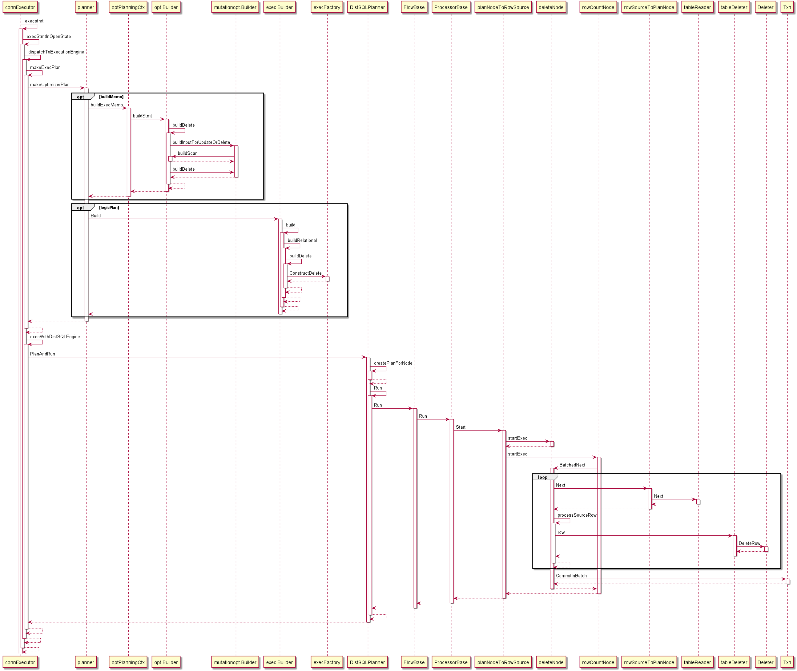
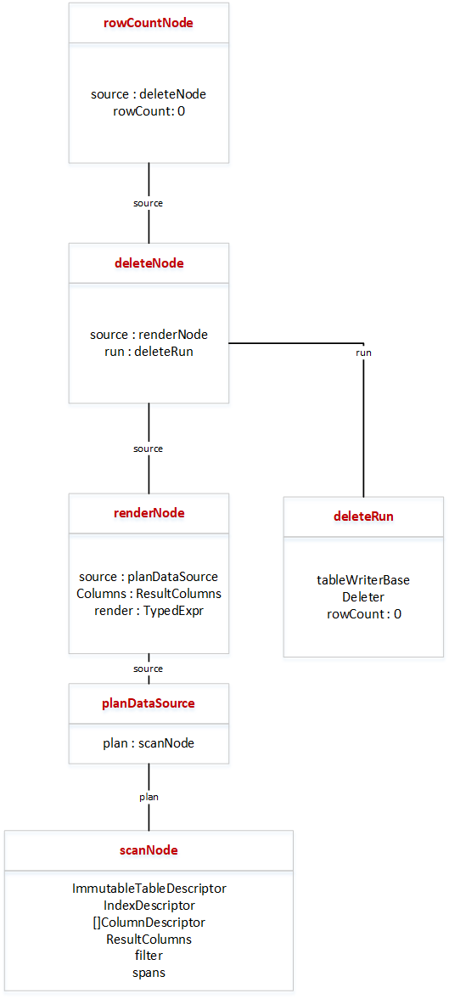

# delete流程梳理
简单delete语句delete from table where xxx的执行流程为：

delete主要分为两个部分，一个部分为scan过程，拉取表中的数据，第二部分，根据过滤条件，调用b.Del()函数删除对应的数据。相关逻辑计划对象图为：

deleteNode下包含一个scanNode，负责拉取表中数据，deleteRun包括实际执行delete操作的信息，包括表中数据的索引信息，事务相关信息txn，batch...，还有tabledesc等等信息。

其中在构建逻辑计划时，有一个maybeCreateDeleteFastNode函数，来判断是否可以执行deleterange操作，判断条件为：

1.表中是否具有索引，如果有，不可以执行deleterange

2.该表是否为交错表，如果是，不可以执行deleterange

3.该表主键是否关联了其他表的外键，如果是，不可以执行deleterange

4.renderNode下是否为scanNode，如果不是，不可以执行deleterange

5.过滤条件没有被下推为span，不可以执行deleterange

6.有limit关键字时，不可以执行deleterange

在满足以上过滤条件后，如果可以执行deleterange，就会把其中的deleteNode转化为deleteRangeNode，在执行时，rowCountNode的startExec会直接调用到deleteRangeNode的startExec，通过直接下发对span的DelRange操作来删除数据。不会调用到BatchNext中

deleteRange过程部分代码:
spans := make([]roachpb.Span, len(d.spans))
    copy(spans, d.spans)
    for len(spans) != 0 {
        b := params.p.txn.NewBatch()
        for _, span := range spans {
            if traceKV {
                log.VEventf(ctx, 2, "DelRange %s - %s", span.Key, span.EndKey)
            }
            b.DelRange(span.Key, span.EndKey, true /* returnKeys */)
        }
        b.Header.MaxSpanRequestKeys = TableTruncateChunkSize
 
        if err := params.p.txn.Run(ctx, b); err != nil {
            return err
        }
 
        spans = spans[:0]
        for _, r := range b.Results {
            var prev []byte
            for _, keyBytes := range r.Keys {
                // If prefix is same, don't bother decoding key.
                if len(prev) > 0 && bytes.HasPrefix(keyBytes, prev) {
                    continue
                }
 
                after, ok, err := d.fetcher.ReadIndexKey(keyBytes)
                if err != nil {
                    return err
                }
                if !ok {
                    return pgerror.NewAssertionErrorf("key did not match descriptor")
                }
                k := keyBytes[:len(keyBytes)-len(after)]
                if !bytes.Equal(k, prev) {
                    prev = k
                    d.rowCount++
                }
            }
            if r.ResumeSpan != nil && r.ResumeSpan.Valid() {
                spans = append(spans, *r.ResumeSpan)
            }
        }
    }
