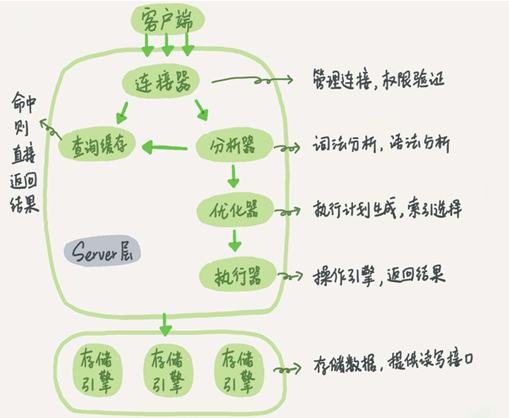
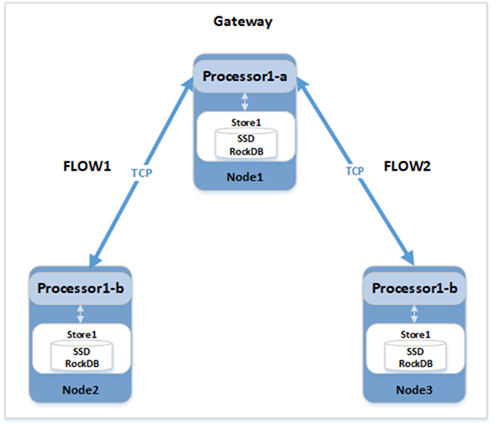

# 执行器概述

执行器执行之前，需要计划的支撑。计划分为逻辑计划和物理计划。他们的关系就好比是我们要出去旅游，选择什么交通工具就相当于逻辑计划，在这一步比如选择了飞机后。选择哪家航空公司就相当于物理计划。最后，当你真正动身去旅游就相当于执行。下面给出SQL语句执行的基本构架图，从中可以清楚地看到优化器和执行器在整个流程中的执行过程。

*优化器*

逻辑计划和物理计划负责生成执行计划和索引选择等功能，可以把它看做优化器。比如执行这样的语句，执行两个表的join：

Select * from t1 join t2 using(ID) where t1.c = 10 and t2.d = 20;

既可以先从t1里取出c=10记录的ID，再根据ID关联到t2,再判断t2里面d的值是否等于20，也可以先从t2里取出c=20记录的ID，再根据ID关联到t1,再判断t2里面d的值是否等于10。这两种执行方法的逻辑是一样的，但执行效率不同，优化器可以预估代价决定使用方案。在分布式数据库中，其中的物理计划还可以根据要用到的数据span所在的节点判断该算子在哪个节点上执行，从而实现分布式执行。与分布式相关的物理计划具体作用在分布式执行概述。

*分布式执行*

分布式执行的关键思想是如何从逻辑执行计划到物理执行计划，这里主要涉及两方面的处理，一个是计算的分布式处理，一个是数据的分布式处理。

一旦生成了物理计划，系统就需要将其拆分并分布到各个node之间进行运行。每个node负责本地调度processors 和 inputs。node还需要能够彼此通信以将输出output router连接到input。特别是，需要一个streaming interface来连接这些组件。为了避免额外的同步成本，需要足够灵活的执行环境以满足上面的所有这些操作，以便不同的node除了执行计划初始的调度之外，可以相对独立的启动相应的数据处理工作，而不会受到gateway节点的其他编排影响。

数据库的集群中的Gateway node会创建一个调度器，它接受一组flow，设置输入和输出相关的信息，创建本地processor并开始执行。在node对输入和输出数据进行处理的时候，我们需要对flow进行一些控制，通过这种控制，我们可以拒绝request中的某些请求。

每个Flow表示整个物理计划中跨节点执行的一个完整片段，由processors和streams组成，可以完成该片段的数据拉取、数据计算处理和最终得数据输出。如下图所示：

对于跨节点得执行，Gateway node首先会序列化对应得FlowSpec为SetupFlowRequest，并通过GRPC发送到远端node，远端node接收后，会先还原Flow，并创建其包含得processor和交互使用得stream（TCP通道），完成执行框架得搭建，之后开始由网关节点发起驱动得多节点计算。Flow之间通过box缓存池进行异步调度，实现整个分布式框架得并行执行。

对于本地执行，就是并行执行，每个processor，synchronizer和router都可以作为goroutine运行，它们之间由channel互联。这些channel可以缓冲信道以使生产者和消费者同步。

为实现分布式并发执行，数据库在执行时引入了Router的概念，对于JOIN和AGGREGATOR等复杂算子根据数据分布特征，实现了三种数据再分布方式，mirror_router、hash_router和range_router，通过数据再分布实现processor算子内部拆分为两阶段执行，第一阶段在数据所在节点做部分数据的处理，处理后结果，根据算子类型会进行再分布后，第二阶段汇集处理，从而实现了单个算子多节点协作执行。
