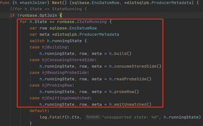

# HashJoin的执行分析（代码解读）与优化
## HashJoin执行
### 常规的hashjoin流程
①   选择inner表，读取出inner表全部数据

②   循环读取outer表中的每一行数据，同inner表全部数据做hashjoin操作

③   进入hashjoin计算，把符合hashjoin条件的outer表一条记录和inner表的一条记录做combine，此时combine的一条记录则为hashjoin计算的一次结果，交予上层处理

### ZnBase hashjoin的实现分析（代码解读）
Hashjoin在进行时会不断变更状态，进入对应的阶段做处理

阶段一、build（hjBuilding时进入）

阶段二、consumeStoredSide（hjConsumingStoredSide时进入）

阶段三、readProbeSide（hjReadingProbeSide时进入）

阶段四、probeRow（hjProbingRow时进入）

Hashjoin的入口在pkg\sql\distsqlrun\rowexec\hashjoiner.go文件，hashjoiner的Next方法当中

①   判断hashjoin的状态，为hBuilding时进入build函数，此时会做以下处理：

循环读取left或right两张表数据（drdb里面称为两侧（side）），获取两张表内存使用量，尝试将数据占用量小的（inner join情况）一侧确定为storedSide（即inner表）

①   判断hashjoin的状态，为hBuilding时进入build函数，此时会做以下处理：

循环读取left或right两张表数据（drdb里面称为两侧（side）），获取两张表内存使用量，尝试将数据占用量小的（inner join情况）一侧确定为storedSide（即inner表）

将每次循环获取的一行记录加入到对应side（left or right）的RowContainer当中，此时对应side的内存用量会增长

每次循环读取数据时都会通过一些条件更新hashjoin的状态

a、当两个side的memUsage都超过hashjoin的initialBufferSize设定值时，会进入setStoredSideTransition处理，初始化storedRows（下一阶段会讲到），将当前side确定为storedSide，更新hashjoin的状态为hjConsumingStoredSide

b、当AddRow超过对应side的RowContainer大小时，初始化storedRows，将当前side确定为storedSide，更新hashjoin的状态为hjConsumingStoredSide

c、  当某一side的数据读取完成时，将当前side确定为storedSide，初始化storedRows，将当前side确定为storedSide，更新hashjoin的状态为hjConsumingStoredSide

d、其他条件，退出hashjoin计算

② 经过①阶段，hashjoin的状态为hjConsumingStoredSide，进入consumeStoredSide函数进行处理  

consumeStoredSide都是处理storedSide的数据，首先会再次去读取storedSide的数据，若读取成功则放入上一阶段初始化的storedRows，

这里storedRows有两种选择：

HashMemRowContainer（全内存存储storedSide数据，超出时会报错）
HashDiskBackedRowContainer（当分配的内存足够时，将storedSide数据不做处理，超出时会将已有的全部数据以及之后读取的新数据存入rocksDB）
直到storedSide的数据被读取完毕，更新hashjoin的状态为hjReadingProbeSide

③  进入readProbeSide函数：
设置当前的side为otherSide（storedSide的另一侧），从otherSide读取一行数据，如果有①阶段缓存则从缓存读出，否则通过tablereader取出

取出一行进行处理，若otherSide数据读取完成，hashjoin计算结束
    

创建storedSide的迭代器（没有则创建），复位迭代器
    

更新hashjoin的状态为hjProbingRow

④ 进入probeRow函数

将storedSide的迭代器取出一行数据（otherRow）同阶段③中取出的otherSide一行数据（row）进行hashjoin计算

如果计算成功，则返回当前成功的一行数据（renderedRow）到上层，并更新hashjoin的状态为hjProbingRow,继续阶段④

如果storedSide的迭代结束，则更新hashjoin的状态为hjReadingProbeSide，进入阶段③

### ZnBase hashjoin执行流程
build阶段：读取两个side数据，inner join情况下会试图确定storedSide(即inner表)，其他情况会直接确定storedSide进入下一个阶段

consumeStoredSide阶段：读取完成storedSide数据，构造hash表，进入下一阶段

readProbeSide阶段：从otherSide（即outer表）取出一行数据，进入下一阶段

probeRow阶段：将上一阶段取出的数据同构造好的hash表进行hashjoin计算

流程图如下：

## HashJoin优化
drdb hashjoin优化方案
其核心优化点关注两方面:

将读取outer表和hash join计算分离，使得读取outer表下一行数据不必再等待上一个hash join计算完成
启用多个join worker参与hash join计算，提高并行度
优化后hashjoin由三个部分完成：

1、  Main thread

2、  Outer Fetcher（go routing）

3、  Join Worker(s) （go routing）

各部分作用如下：

Main thread:

读取全部inner 表（可以理解为drdb的storedSide）数据，构造hash表
启动Outer Fetcher和join Woker(s)

从join Woker拿取计算结果，返回至上层

Outer Fetcher

循环读取Outer表（可以理解为drdb的otherSide）每一行数据，将读取的数据通过channel传递给Join Woker进行计算

通知Join Woker Outer表读取完成

Join Workers

Join Worker可以有一个或多个，将Outer Fetcher发送来的数据进行hash join计算

将计算结果通过channel发送至Main thread

通知Main thread计算是否完成

以上各部分的交互主要涉及到四种channel:

outerResultChs：每个 Join Worker 一个，Outer Fetcher 将获取到的 Outer Chunk 写入到这个 channel 中供相应的 Join Worker 使用

outerChkResourceCh：当 Join Worker 用完了当前的 Outer Chunk 后，它需要把这个 Chunk 以及自己对应的 outerResultChs 的地址一起写入到 outerChkResourceCh 这个 channel 中，告诉 Outer Fetcher 两个信息：

1、我提供了一个 Chunk 给你，你直接用这个 Chunk 去拉 Outer 数据吧，不用再重新申请内存了；

2、我的 Outer Chunk 已经用完了，你需要把拉取到的 Outer 数据直接传给我，不要给别人了。

joinResultCh：每个 Join Worker 一个，用来存 Join 的结果

joinChkResourceCh：Join Worker 将 Join 的结果 Chunk 以及它的joinResultCh 地址写入到这个 channel 中，告诉 Main Thread 两件事：

1、我计算出了一个 Join 的结果 Chunk 给你，你读到这个数据后可以直接返回给你 Next 函数的调用方；

2、你用完这个 Chunk 后赶紧还给我，不要给别人，我好继续干活

整个方案流程可用下图简单示意：

优化前后对比分析（理论分析）
设构造inner（storedSide）一侧的hash表时间为t1

设读取一条outer（otherSide）数据时间为t2

设执行一轮hashjoin时间为t3

设outer（otherSide）表有m条数据

优化前：

优化后：

执行完hashjoin：

优化前耗时≈t1+m*t2+m*t3

优化后耗时≈t1+(m/n)*t3

Δt≈(m(n-1))/n t3+m*t2

预期：随着outer表数据增多和join worker协程数增加，理论上优化越明显
