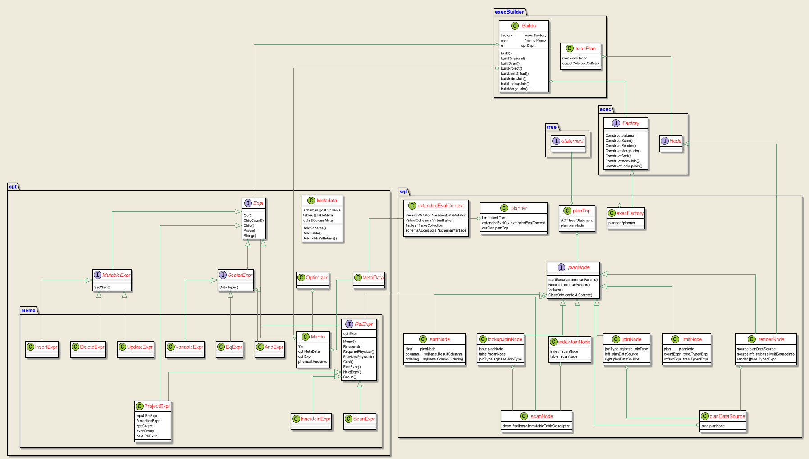
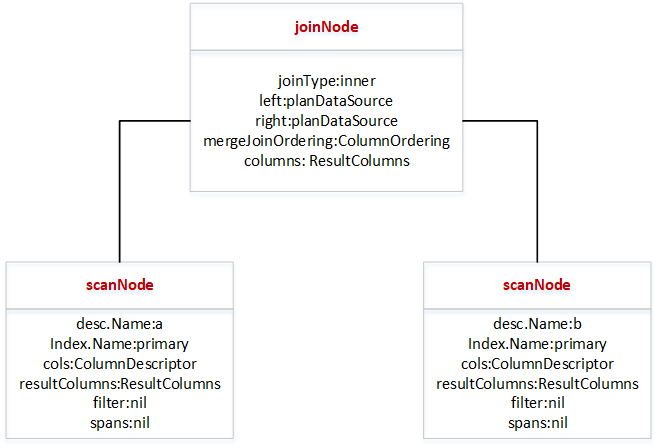
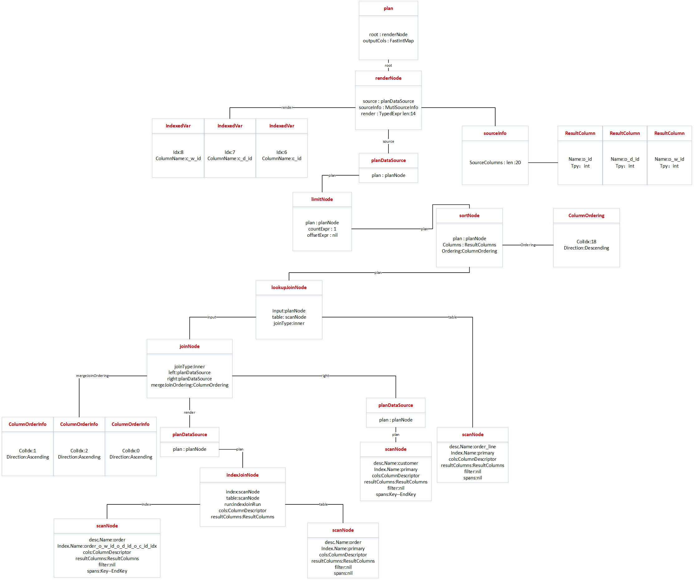

# 逻辑计划
## 一、逻辑计划概念
逻辑计划在语法解析，语义解析后，构建物理计划执行前，为构建物理计划添加一些额外的表信息，列信息等。

在走优化时，逻辑计划为优化后的memo转换成一个plannode的树状结构，不走优化或者不支持优化时，逻辑计划由AST树直接转换。从下向上构建。

plannode为一接口，实现了数据库中执行语句的所有操作包含：
alterIndexNode
alterSequenceNode
alterTableNode
alterSchemaNode
cancelQueriesNode
cancelSessionsNode
createDatabaseNode
createIndexNode
createSequenceNode
createStatsNode
createTableNode
CreateUserNode
createViewNode
createSchemaNode
delayedNode
deleteNode
deleteRangeNode
distinctNode
dropDatabaseNode
dropIndexNode
dropSequenceNode
dropTableNode
DropUserNode
dropViewNode
dropSchemaNode
explainDistSQLNode
explainPlanNode
filterNode
groupNode
hookFnNode
indexJoinNode
insertNode
joinNode
limitNode
max1RowNode
ordinalityNode
projectSetNode
relocateNode
renameColumnNode
renameDatabaseNode
renameIndexNode
renameTableNode
renderNode
rowCountNode
scanNode
scatterNode
serializeNode
sequenceSelectNode
showFingerprintsNode
showTraceNode
sortNode
splitNode
truncateNode
unaryNode
unionNode
updateNode
upsertNode
valuesNode
virtualTableNode
windowNode
zeroNode
大多数DDL语句，show语句走非优化创建逻辑计划，生成简单语句对应的plannode，包括了执行时需要的所有信息，通过调用plannode.startExec执行。\
switch t := AST.(type) {
    case *tree.ParenSelect, *tree.Select, *tree.SelectClause,
        *tree.UnionClause, *tree.ValuesClause, *tree.Explain,
        *tree.Insert, *tree.Update, *tree.Delete, *tree.CreateView,
        *tree.CannedOptPlan, *tree.CreateTable:
上面case对应的AST类型，可以走优化创建逻辑计划，将memo表达式转化为逻辑计划。

##二、逻辑计划内容
逻辑计划负责把对应的relExpr（或者AST数）转换成对应的plannode。包括了一些scannode中tabledesc的数据填充和其他node中colDesc的信息补充，filter过滤条件转化为span等等过程。

创建逻辑计划前要构建execBuilder.Build。此结构体包括三个主要部分，execFactory，memo，RelExpr，memo和RelExpr为创建memo过程后创建出来的。execFactory中包括planner，planner贯穿sql的整个执行流程，其中包括构建memo中原数据用到的schema信息和table信息。最后结果存在planner的planTop中。

一些简单语句的逻辑计划结果如下：

1.

create table a (a int,b int);

create table b (a int,b int);

select * from a join b on a.a = b.a;

2.

create table a (a int primary key,b int);

create table b (a int primary key,b int);

select * from a join b on a.a = b.a;

3.

create table a (a int primary key,b int);

create table b (a int primary key,b int);

select * from a join b on a.a = b.a and a.a > 5;

4.

create table a (a int primary key,b int);

create table b (a int primary key,b int);

select * from a left join b on a.a = b.a and a.a > 5;

5.

create table a (a int,b int);

create table b (a int primary key,b int);

create index on a (a);

select a.a,b.a,b.b from a join b on a.a = b.a;

6.

create table a (a int,b int);

create table b (a int primary key,b int);

create index on a (a) storing(b);

select * from a join b on a.a = b.a;

table_name | create_statement
+------------+-----------------------------------------------------------------------------------------------------------------------------------------------------------------------------------------------------------------------------------------------+
customer | CREATE TABLE customer (
| c_id INTEGER NOT NULL,
| c_d_id INTEGER NOT NULL,
| c_w_id INTEGER NOT NULL,
| c_first VARCHAR(16) NULL,
| c_middle CHAR(2) NULL,
| c_last VARCHAR(16) NULL,
| c_street_1 VARCHAR(20) NULL,
| c_street_2 VARCHAR(20) NULL,
| c_city VARCHAR(20) NULL,
| c_state CHAR(2) NULL,
| c_zip CHAR(9) NULL,
| c_phone CHAR(16) NULL,
| c_since TIMESTAMP NULL,
| c_credit CHAR(2) NULL,
| c_credit_lim DECIMAL(12,2) NULL,
| c_discount DECIMAL(4,4) NULL,
| c_balance DECIMAL(12,2) NULL,
| c_ytd_payment DECIMAL(12,2) NULL,
| c_payment_cnt INTEGER NULL,
| c_delivery_cnt INTEGER NULL,
| c_data VARCHAR(500) NULL,
| CONSTRAINT "primary" PRIMARY KEY (c_w_id ASC, c_d_id ASC, c_id ASC),
| INDEX customer_idx (c_w_id ASC, c_d_id ASC, c_last ASC, c_first ASC),
| FAMILY "primary" (c_id, c_d_id, c_w_id, c_first, c_middle, c_last, c_street_1, c_street_2, c_city, c_state, c_zip, c_phone, c_since, c_credit, c_credit_lim, c_discount, c_balance, c_ytd_payment, c_payment_cnt, c_delivery_cnt, c_data)
| )

table_name | create_statement
+------------+-----------------------------------------------------------------------------------------------------+
"order" | CREATE TABLE "order" (
| o_id INTEGER NOT NULL,
| o_d_id INTEGER NOT NULL,
| o_w_id INTEGER NOT NULL,
| o_c_id INTEGER NULL,
| o_entry_d TIMESTAMP NULL,
| o_carrier_id INTEGER NULL,
| o_ol_cnt INTEGER NULL,
| o_all_local INTEGER NULL,
| CONSTRAINT "primary" PRIMARY KEY (o_w_id ASC, o_d_id ASC, o_id DESC),
| UNIQUE INDEX order_idx (o_w_id ASC, o_d_id ASC, o_carrier_id ASC, o_id ASC),
| INDEX order_o_w_id_o_d_id_o_c_id_idx (o_w_id ASC, o_d_id ASC, o_c_id ASC),
| FAMILY "primary" (o_id, o_d_id, o_w_id, o_c_id, o_entry_d, o_carrier_id, o_ol_cnt, o_all_local)
| )

table_name | create_statement
+------------+-------------------------------------------------------------------------------------------------------------------------------------------+
order_line | CREATE TABLE order_line (
| ol_o_id INTEGER NOT NULL,
| ol_d_id INTEGER NOT NULL,
| ol_w_id INTEGER NOT NULL,
| ol_number INTEGER NOT NULL,
| ol_i_id INTEGER NOT NULL,
| ol_supply_w_id INTEGER NULL,
| ol_delivery_d TIMESTAMP NULL,
| ol_quantity INTEGER NULL,
| ol_amount DECIMAL(6,2) NULL,
| ol_dist_info CHAR(24) NULL,
| CONSTRAINT "primary" PRIMARY KEY (ol_w_id ASC, ol_d_id ASC, ol_o_id DESC, ol_number ASC),
| INDEX order_line_fk (ol_supply_w_id ASC, ol_i_id ASC),
| FAMILY "primary" (ol_o_id, ol_d_id, ol_w_id, ol_number, ol_i_id, ol_supply_w_id, ol_delivery_d, ol_quantity, ol_amount, ol_dist_info)
| )

 

SELECT c.c_w_id, c.c_d_id,c.c_id,

       c.c_first, c.c_middle, c.c_last,

       o.o_id,o.o_entry_d, o.o_carrier_id,

       ol.ol_number, ol.ol_i_id,

       ol.ol_quantity, ol.ol_amount, ol.ol_dist_info

FROM customer c,

     "order" o,

      order_line ol

WHERE c.c_w_id = 3

      AND c.c_d_id = 6

      AND c.c_id = 10

      AND o.o_c_id = c.c_id

      AND o.o_w_id = c.c_w_id

      AND o.o_d_id = c.c_d_id

      AND ol.ol_o_id = o.o_id

      AND ol.ol_w_id = o.o_w_id

      AND ol.ol_d_id = o.o_d_id

     ORDER BY ol.ol_amount DESC

     LIMIT 1;

