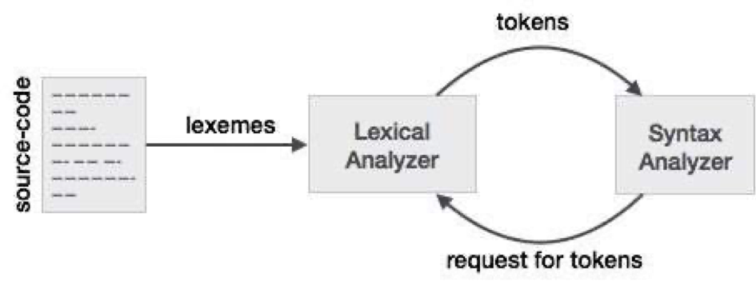
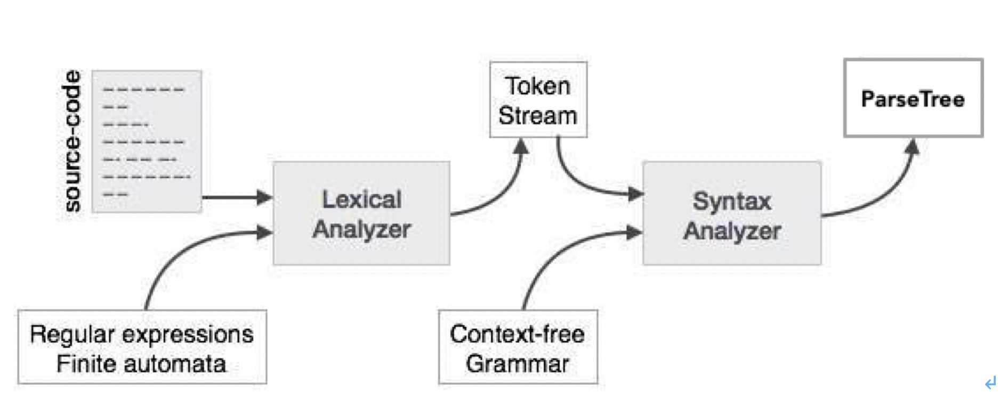
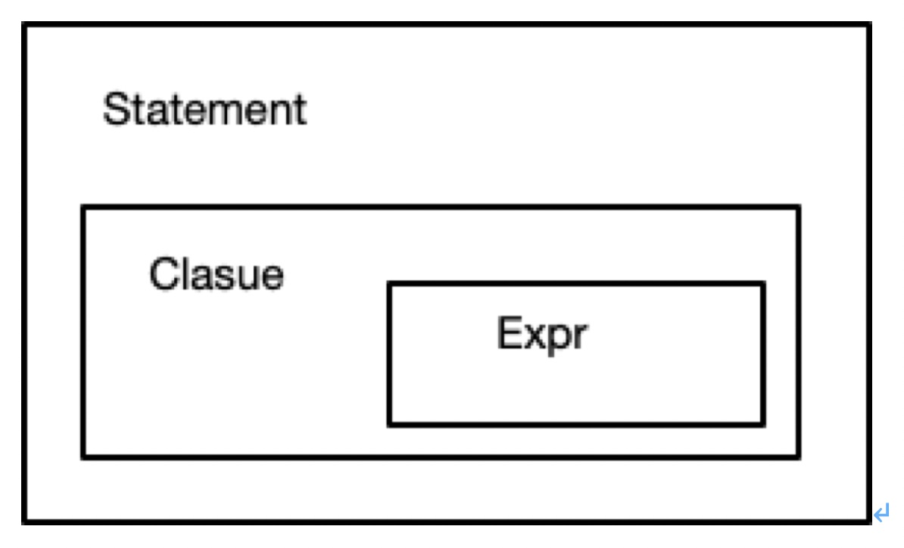
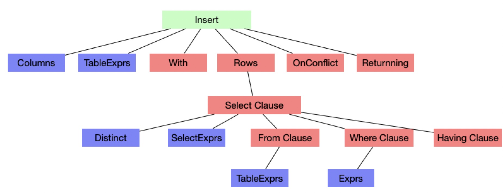
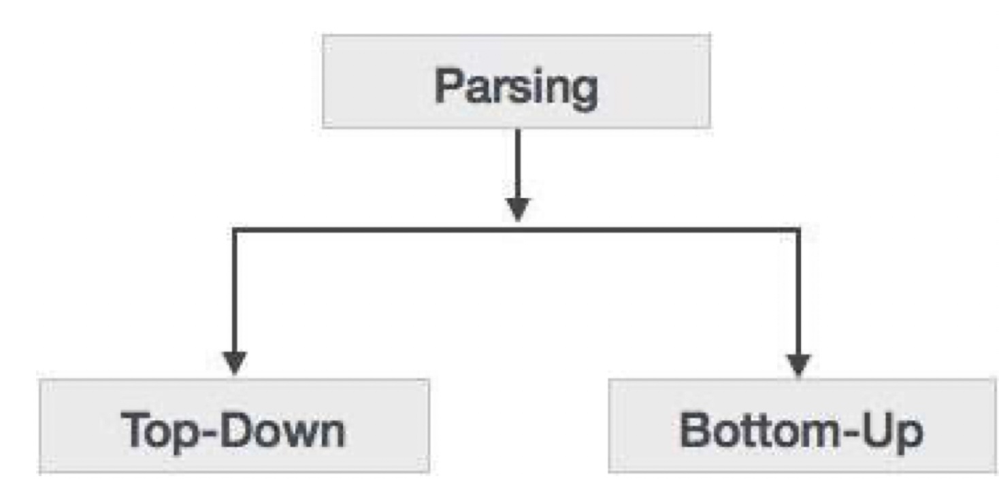

# 解析器概述

*编译原理：* *https://www.tutorialspoint.com/compiler_design/index.htm*

**词法分析**

1. 词法分析是编译第一步。
2. 将语句拆分为token（标记），移除空格和注释。
3. 逐个读入源码中的character，检查是否有效，并传递给语法分析器。
4. 两个核心知识点分别是正则表达式（regular expression）和 有限自动机（finite automata）。使用正则表达式可以标准地表示词法结构的串格式，而有限自动机应用于串格式的识别。



5.  token 分为：[select * from test1 where t1.a > 100 and t1.b = 'peter' ]
   keywords: 关键字 select , from , where  ...
   ident: 标识符, a, b, t1
   number: 数字， 100
   string：字符串, 'peter'
   symbols: 符号： '>',  '.',  '='
6. znbase 代码: pkg/sql/lex/  pkg/sql/parser/scan.go**(LL lexer)**  pkg/sql/parser/lexer.go
   postgres 代码：scan.l


**语法解析**

1. 语句是什么？

​            语句 [yǔ jù]  [sentence] 一个语法上自成体系的单位,它由一个词或句法上有关连的一组词构成,表达一种主张、疑问、命令、愿望或感叹。

​            语句[yǔ jù]
​            sentence; **statement**

2. SQL statment 是什么？  *https://docs.oracle.com/cd/B19306_01/server.102/b14200/statements_1001.htm*

- [Data Definition Language (DDL) Statements](https://docs.oracle.com/cd/B19306_01/server.102/b14200/statements_1001.htm#i2099120)
- [Data Manipulation Language (DML) Statements](https://docs.oracle.com/cd/B19306_01/server.102/b14200/statements_1001.htm#i2099257)
- [Transaction Control Statements](https://docs.oracle.com/cd/B19306_01/server.102/b14200/statements_1001.htm#i2099286)
- [Session Control Statements](https://docs.oracle.com/cd/B19306_01/server.102/b14200/statements_1001.htm#i2099318)
- [System Control Statement](https://docs.oracle.com/cd/B19306_01/server.102/b14200/statements_1001.htm#i2099335)
- [Embedded SQL Statements](https://docs.oracle.com/cd/B19306_01/server.102/b14200/statements_1001.htm#i2099350)

3. 语法解析的目的：



​     输入： Token Stream

​     程序 = 数据结构 + 算法

​     语法解析的目的，就是将词法分析的结果token stream 运用一定的算法进行分析重组， 构建一定的数据结构在   计算机中进行存储的过程。

语法解析的两个核心： 1.  语法在计算机中存储的方法。 2. 用何种算法进行解析。

1. 存储方法： ParseTree AST 抽象语法树。

   

   ​        Insert into zhangsan select * from zhangsan.a > 1000;

   

2. 解析算法：

   

   ​		 Bottom-up: 自底向上分析方法。

   ​         Top-Down: 自顶向下的分析方法。

   ​         自底向上的分析方法：LALR(1)  go-yacc

   ​         L: 指从左向右进行扫描。 R: 代表反向构造出最右推导序列。

   ​         LA=> look ahead （1）表示向右看一个token。

   ​        shift : 移进

   ​        reduce: 规约

   ​        CREATE opt_temp TABLE IF NOT EXISTS table_name '(' opt_table_elem_list ')' opt_interleave opt_partition_by opt_table_with opt_locate_in

   ​         {

   ​         }
   ​         | CREATE TABLE IF NOT EXISTS table_name '(' opt_table_elem_list ')' opt_interleave opt_partition_by opt_table_with opt_locate_in
   ​         {

   ​         }

**语义解析**

- Semantics of a language provide meaning to its constructs, like tokens and syntax structure.  
- Semantics help interpret symbols, their types, and their relations with each other.
- Semantic analysis judges whether the syntax structure constructed in the source program derives any meaning or not.

1. **Name Resolution, 命名解析，table name, column name, view name......**

```SQL
WITH scope0 AS
  (SELECT col
   FROM scope1
   WHERE scope1.col > 2000)
SELECT a.col,
       b.col,
       c.col
FROM scope0 a,
     scope2 b,
     scope3 c
WHERE a.col = b.col
  AND b .col = c.col;
 
 
SELECT col
FROM scope0
WHERE col IN
    (SELECT col
     FROM scope1)
  AND scope0.col = scope1.col;
 
 
SELECT col
FROM scope0
WHERE col IN
    (SELECT col
     FROM scope1
     WHERE scope0.col = scope1.col);
```

2. **Type Checking, 类型检查, 列类型，函数类型， 变量类型，类型转换**

   ```sql
   create table t1(a int);
   insert into t1 values ('abc');
   ```

3. **权限检查，** tables, views, functions, etc,  select, insert, delete, update, create, drop, alter, etc