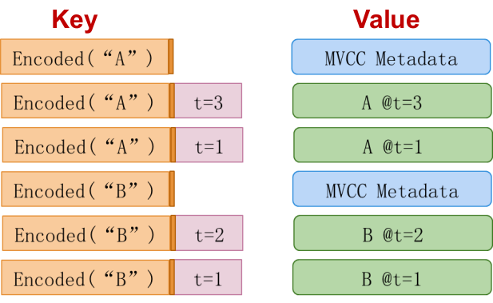
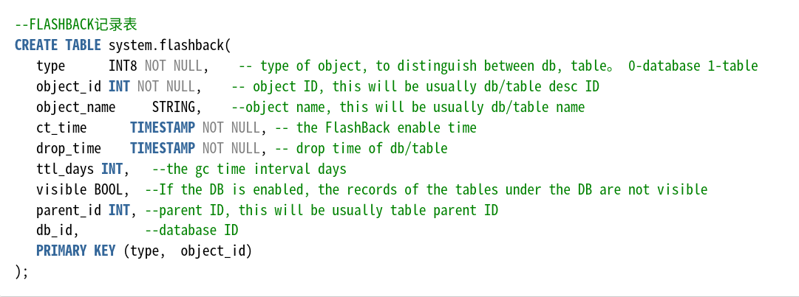
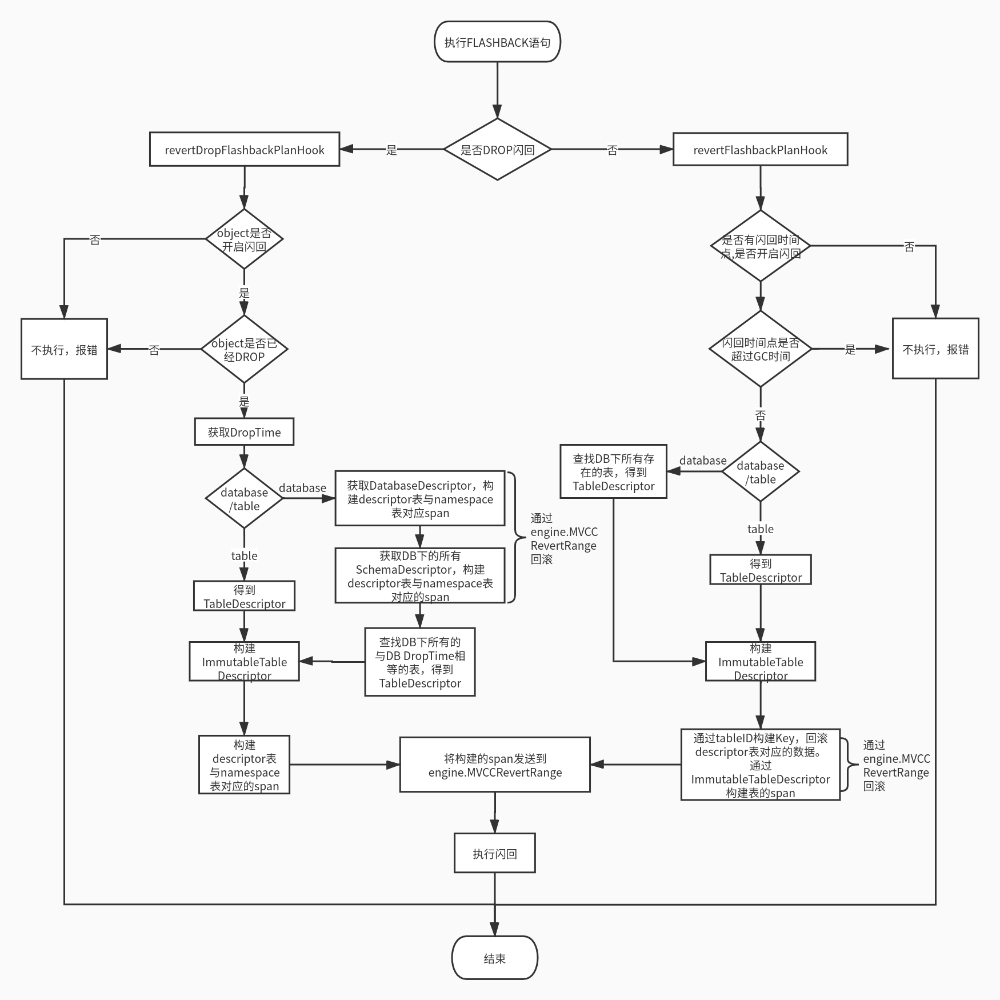
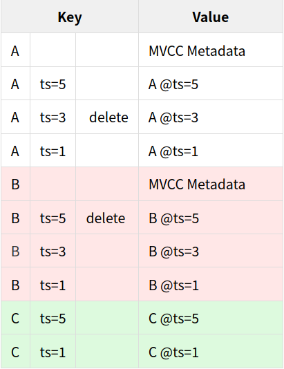

# FLASHBACK代码解读

通常我们对数据库进行了误操作时， 需要把数据库Rollback到之前的版本。一个常用的方法就是使用日志来进行数据库恢复。这个方法虽然强大有效，但是花费时间等成本高。而FLASHBACK功能，可以在设置库表开启FLASHBACK功能，开启后能够保留指定时间段内的版本数据，可读取指定时间点（要晚于开启时间）的数据版本，也可以回退到指定时间状态，从而达到高效、可靠的数据备份恢复能力。

## FLASHBACK实现原理


FLASHBACK的实现主要利用了MVCC-多版本并发控制来存储KV数据，Key使用时间戳作为数据的版本号。同一Key的多个版本按照时间戳倒序排序。时间戳ts=0的数据表示写数据的事务还未提交，数据在WriteIntent中，值是Metadata。对于多版本的数据会定时清理，FLASHBACK在开启时可以设置数据保留的时间段，从而实现数据快速“备份”和恢复。

## FLASHBACK数据模型


flashback表作为系统表，需要分配系统表ID，并在系统启动时进行初始化。在pkg/sql/sqlbase/system.go可以查到flashback表的详细定义。

## FLASHBACK代码流程


执行FLASHBACK之前需要先校验是否满足闪回条件，如果是表的闪回，需要得到该表的descriptor。如果是库的闪回，需要得到该库的所有表的descriptor。

FLASHBACK语句主要有两个，分别闪回DROP后的库/表和闪回存在的库/表数据。

* 库表数据闪回首先需要恢复系统表descriptor表中对应的key到闪回时间点：通过sqlbase.MakeDescMetadataKey构建要恢复的descriptor表中的startkey、endKey，通过batch.RevertRange发送到MVCCRevertRange。然后根据表的descriptor构建span，通过batch.RevertRange发送到MVCCRevertRange。

* 库表DROP、TRUNCATE闪回(TRUNCATE闪回必须先删除该表)不需要恢复表中数据，只需要恢复系统表namespace表与descriptor表中对应的key到闪回时间点。通过sqlbase.MakeDescMetadataKey构建要恢复的descriptor表中的key，通过sqlbase.MakeNameMetadataKey构建要恢复的namespace表中的key，通过batch.RevertRange发送到MVCCRevertRange。

### MVCCRevertRange主要流程

MVCCRevertRange是闪回的主要代码，利用MVCC多版本机制，根据同一key的多个版本的时间戳与闪回时间点的比较，将数据闪回到指定时间点。主要流程为：

1.查询闪回点到当前时间点发生变化的数据，启动新的事务。

2.闪回点后新增加的数据，使用DELETE标记覆盖。

3.闪回点后修改或删除的数据，使用闪回时间点前的值覆盖。

4.在闪回期间，该数据库或表不能有其他事务。

   ``` go
		if !unsafeKey.Key.Equal(preKv.Key.Key) { // 处理新的key
			if int64(len(snapKVs)) > max {
				resumeSpan.Key = iter.Key().Key
				break
			}

			if preKv.Key.Key != nil && snapshotTs.Less(preKv.Key.Timestamp) && len(preKv.Value) != 0 {
				// 前一个key的时间戳都大于快照点，表示新增加数据，需要删除
				// 如果最新的数据已经delete，则不处理
				snapKVs = append(snapKVs, MVCCKeyValue{Key: preKv.Key, Value: nil})
			}

			if unsafeKey.Timestamp.LessEq(snapshotTs) {
				//新的key，第1个版本的ts小于快照点，不用处理，跳到下一个Key
				//iter.NextKey()
				nextKey = true
				preKv = MVCCKeyValue{}
				continue
			}

			preKv = MVCCKeyValue{Key: iter.Key(), Value: iter.Value()}
		} else {
			if unsafeKey.Timestamp.LessEq(snapshotTs) {
				// 使用快照点数据覆盖新数据
				snapKVs = append(snapKVs, MVCCKeyValue{Key: iter.Key(), Value: iter.Value()})
				nextKey = true
				preKv = MVCCKeyValue{}
				continue
			}
		}
   ```

## MVCC GC流程分析

1.主要代码集中在gc_queue.go、gc.go、mvcc.go的MVCCGarbageCollect方法。

2.RunGC查找需要GC的KV,然后将相同Key的kv组成一组，调用内部函数processKeysAndValues，查找到该组key中需要GC的key,processKeysAndValues会调用gc.Filter方法，找到小于GC时间的KV，并构造GC请求，调用gcer.GC批量发送该GC请求。

3.MVCCGarbageCollect完成实际的kv清理。

4.创建FLASHBACK时会指定要保留数据的时间（不能超过8天），engine.MakeGarbageCollector会更新对应数据的过期时间。

5.实例分析：对于多版本的数据，会有gc_queue定时清理，以下表为例：



 假设当前时间ts=8，TTL=4，则ts=4之前的多版本数据是需要清理的。
 根据该规则，Key-A：A @ts=1 会被GC，A @ts=3也会GC，因为已经标记delete。
 Key-B：B @ts=1会GC，B @ts=3虽然过期，但最新数据还未过期，所以次新数据也不会GC。 B @ts=5虽然被标记为delete，但还在intent。
 Key-C：没有GC。C @ts=1虽然过期，但最新数据还未过期，所以次新数据也不会GC。
 
 