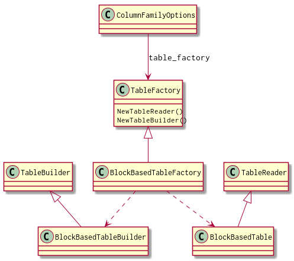
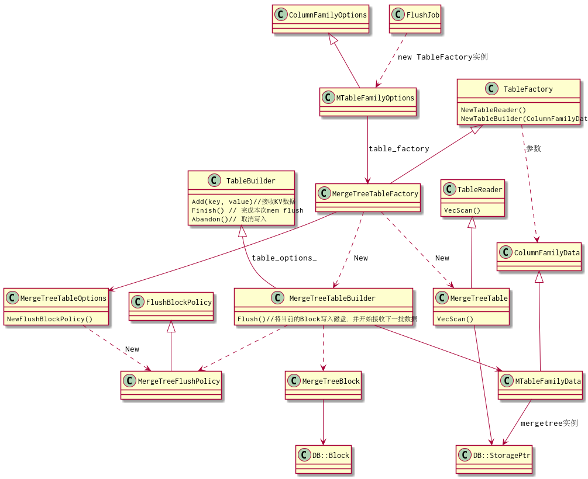
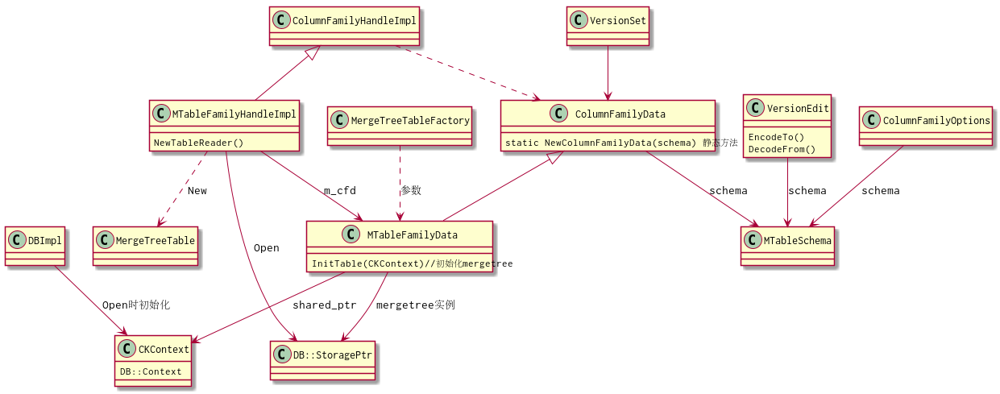
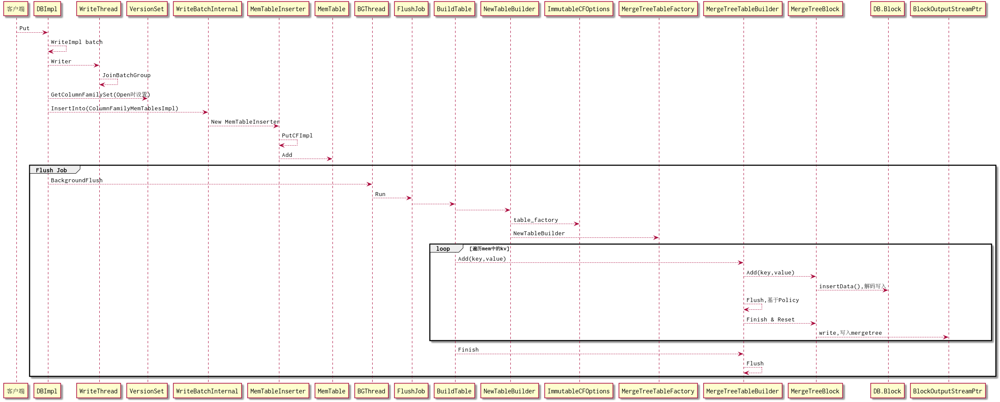
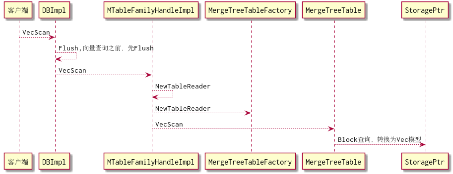

# 列存引擎 MergeTree 读写设计

## Flush流程调研
rocksdb的内存表数据flush到磁盘的数据格式是可定制的，默认是SST，使用BlockBasedTableBuilder写SST文件，由FlushJob执行。

模型如下：   

     

TableFactory主要提供2个方法，用于创建Builder-写数据，和 Reader-读数据。
客户端可以设置table_factory，自定义TableBuilder的实现，默认是BlockBasedTableBuilder，将KV数据写入SST文件。

## MergeTree Flush模型
参照SST的flush模型，设计mergetree flush模型如下：  

  

MergeTree列族的MTableFamilyOptions的table_factory设置为MergeTreeTableFactory，用于创建MergeTreeTableBuilder和MergeTreeTable。  
MergeTreeTableBuilder用于接收KV数据，并使用MergeTreeBlock辅助类组织DB::Block数据，根据FlushBlockPolicy的策略决定是否执行Block数据持久化。（策略一般就是满足一定大小后可以flush)。  
MergeTreeTable用于读取MergeTree实例数据，暂只支持VecScan的向量读取，Get、Iterator等方法可标记为UnSupport。  
MergeTreeTableBuilder和MergeTreeTable所需要的mergetree实例是ClickHouse的DB::StoragePtr对象，通过MTableFamilyData对象持有。  
该对象需要在TableFactory创建builder由参数传入，因此重构NewTableBuilder方法，增加ColumnFamilyData参数。  
而MergeTreeTable是由MTableFamilyHandleImpl创建，不需要在TableFactory增加参数。  

## MTableFamilyData结构
因此，需要重构ColumnFamilyData的结构如下：  

      

新增MTableFamilyData，关联一个mergetree实例及DB::Context。

在DBImpl新建MTableFamilyHandleImpl时，会创建MTableFamilyData，然后调用InitTable初始化建表，打开mergetree实例。

MTableFamilyHandleImpl增加GetTableReader，用于创建MergeTreeTable，并传入mergetree实例。

## KV数据Flush流程
客户端依然是kv数据写入，在memtable刷盘时再写入mergetree实例，流程示意如下：  

        


DBImpl打开后会启动一个后台Flush 线程，Flush线程使用TableBuilder写文件。而TableBuilder是可扩展的，通过table_factory参数设置，在我们rocksmt中强制为MergeTreeTableFactory。

MergeTreeTableFactory会创建TableBuilder-用于写文件,rocksmt扩展实现了MergeTreeTableBuilder。

## 向量查询流程设计
向量查询流程相对简单，示意如下：  

  

根据列存引擎详细设计方案中的考虑，我们在向量查询之前先执行Flush，之后的向量查询只需要从MergeTree实例中查。一方面不用实现memtable的"kv-向量"转换，另一方面只从MergeTree查询也可以保证列存的高性能。

## KV 数据Flush设计
```
//add 方法
void MergeTreeTableBuilder::Add(const Slice &key, const Slice &value) {
  
// TODO-1 解析key，得到roachpb.Key 赋值给 raw_key_ , 及hlc时间戳
//      再解析roachpb.Key，得到列值，并根据schema主键定义得到列ID
//     如果value长度=0，则判断为drdb sql的Delete， 设置delete_flag_=1
// TODO-2 如果hlc=0，则判断为Intent数据，组织行数据[raw_key_,value,delete_flag_]写入intent_表
// TODO-3 解析value，得到列id、类型、列值， 如果delete_flag_=1，则所有列值=null
// TODO-4 组织行数据[raw_key_,hlc_,delete_flag_, 主键列ID，主键列值，列ID，列值...]写入mergetree
  
 
if(value_type == kTypeDeletion){
  // TODO-5 删除操作(GC、intent清理)，从schema表或intent_表的mergetree，删除数据, StorageMergeTree::mutate函数
  // 创建MutationCommand命令，组织成MutationCommands
  // 满足条件（数量），执行 DB::StorageMergeTree::validate 、 mutate 。
  // 相关说明： https://zhuanlan.zhihu.com/p/144020199 , https://www.jianshu.com/p/521f2d1611f8
}else{
  r->data_block.Add(key, value);
}
```

## 向量查询设计
```
 /* TODO-1，参考MVCCScan，还需要增加参数：
 *    DBTimestamp :最大时间戳，可作为条件：hlc_<= DBTimestamp ?
 *    DBTxn txn  ： 当前事务，用于判断intent是否与当前事务一致，列存不需要。
 *    bool inconsistent ： 非一致查询，如果查询到intent，返回前一个timestamp（RC隔离级别，列存不支持）
 *    bool tombstones ： 墓碑查询，条件：delete_flag_ <= 1，列存不支持?
 *    bool ignore_sequence : rocksdb中的sequence，暂不支持
 *
 * TODO-2, start_key和end_key是不含时间戳的， 构造查询条件：
 *              raw_key_>=start_key and raw_key_<end_key
 *              and hlc<=DBTimestamp
 *        排序： raw_key_ 正序 , hlc_ 逆序, delete_flag_ 逆序
 *   分别查询业务表和intent_表。
 * TODO-3, 业务表查询，返回唯一的[raw_key_,hlc]，即每个raw_key_只返回最新时间戳。
 *         业务表数据组织为VecBatch
 * TODO-4, intent_表的数据组织成kv数据集，格式参考MVCCScan的返回值
 * TODO-5, pipe查询中遇到delete_flag_，则丢弃该数据，并跳过raw_key_的其他记录
 * */
```