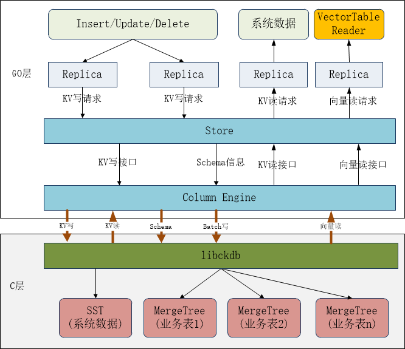
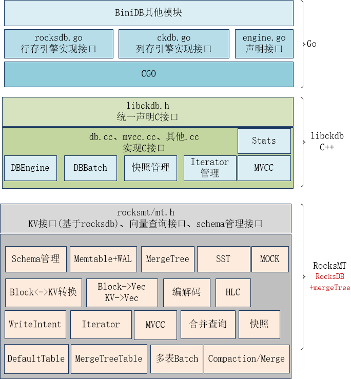
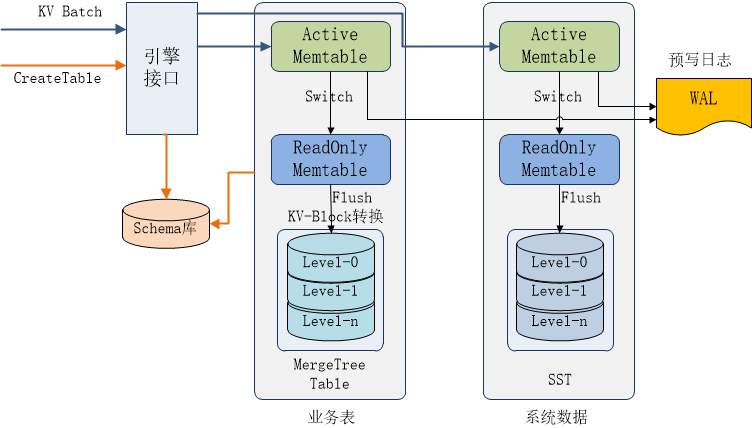
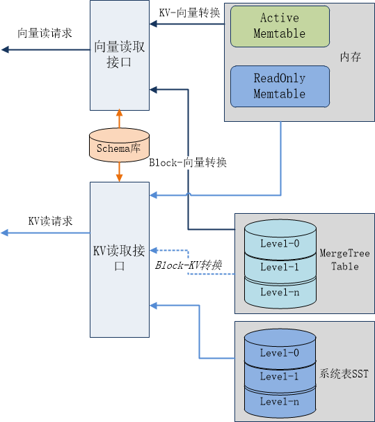
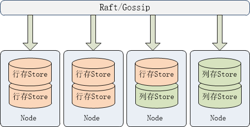

# 列存引擎架构设计
## 功能架构
基于DRDB当前架构及HTAP的总体需求，我们设计的列存引擎架构如下： 

    

在存储格式上libckdb采用ClickHouse MergeTree存储核心，其优点是:LSM-Tree思想、数据有序、数据去重能力。这些特性比较贴合我们DRDB的架构需求，在技术实现上会容易一些。

在业务表数据存储时，DRDB中的每个Table都对应一个MergeTree存储实例，libckdb管理所有的MergeTree实例。每个MergeTree实例都需要DRDB Table 的Schema信息，因此drdb SQL层需要把Schema信息通知到列存引擎。

一个Table在同一列存引擎的多个Range数据都是存储在一个MT实例中，SQL Table的Range分片、副本管理依然由drdb管理，而不是用ClickHouse的分布式表管理。

由于我们设计的是HTAP混存、多模的架构，一个Range的多个Replica可能有行存（RocksDB)、列存混合的情况，而在drdb的设计中，Range的多个Replica构成一个Raft Group，在Raft Group内通过Raft协议达成一致后，由Leader将需要持久化的数据通知到各节点存储，而这个数据格式在drdb中是RocksDB WriteBatch格式，因此libckdb需要实现兼容的KV写接口，并在内部落盘时以SST格式存储。

而在业务数据读取时，需要从Lease Holder读取数据给SQL层，因此可以在Column Engine直接提供向量读取接口，SQL层新建VecTableReader，发送向量读取请求-VecScanRequest到Replica，再由Replica调用列存引擎的向量接口返回数据。

同时列存引擎依然提供兼容的KV读取接口，用于KV模型表数据的读取。

## 技术架构
列存引擎在技术实现上，同样有GO层和C++程序组成。GO层实现重构后的engine接口，对上层模块提供读写服务。C层分为两部分：libckdb和rocksmt，架构示意如下：  

  

libckdb对应到libroach的功能，实现Go层的CGO调用接口，RocksMT以rocksdb为基础重构，在接口上增加向量查询接口、schema管理接口，在内部则集成MergeTree存储，业务表刷盘写入MergeTree。

将rocksdb的Column Family替换为Table，每个RocksMT默认创建DefaultTable用于存储KV数据，落盘时写入SST。MergeTreeTable则是存储业务表数据，落盘时写入MergeTree。

原来libroach的一些功能也将下沉到RocksMT，如编解码、HLC、MVCC等。

## RocksMT写入流程
在DRDB的数据写入流程中，首先由SQL层发出PutRequest到Replica，Replica创建Batch对象，这个Batch是GO内存中的对象，之后的写入操作都是先写入Batch。当请求处理成功之后，会转换为Raft的ProposalData（包含RaftCommand、Batch），并经过RaftGroup的一致性协议，由各节点的handleCommittedEntriesRaftMuLocked方法提交raft日志，并Apply Batch数据到底层存储引擎进行持久化。

在RocksDB定义中，这个Batch对象是原子性提交的，要么全部成功要么全部失败，并且中间结果不可见。而我们的列存引擎设计中每个业务Table对应一个MergeTree实例，Batch对象中可能会包含多个Table的数据，这就需要一种机制来保证Batch的原子性。

同时，MergeTree是一种列式存储引擎，更适合于数据的批量写入，如果每条数据都Flush会产生大量的目录和文件，虽然有后台线程可以进行Merge，但也会极大影响读写性能。

基于以上考虑，参考RocksDB架构，我们设计如下RocksMT的写入架构：  

  

RocksMT在总体架构上借鉴RocksDB的多Family架构，每个业务表包含ActiveMemtable、多个ReadOnly Memtable及一个MergeTree实例。数据首先写入ActiveMemtable，当ActiveMemtable写满之后切换到ReadOnly Memtable，并启用Flush进程将ReadOnly Memtable数据以Block格式写入MergeTree。对于存放系统数据的DefaultTable则以SST格式写入。

多个表共用一个WAL日志，保证了Batch数据的原子一致性，以及Memtable数据的异常恢复。

数据先写入内存再批量写入MergeTree，一是可以保证高速写入，二是批量写入也避免了MergeTree数据文件的碎片化。

Memtable内的数据格式可以采用KV格式，因为Batch写入都是KV格式，并且我们也可以复用RocksDB的相关代码。当内存数据刷盘时，再根据Schema信息将KV转换为列存Block写入MergeTree。

RocksMT提供Table Schema的管理，记录每个MergeTree Table的元数据定义，包括schema、存储目录等。

## RocksMT读取流程

RocksMT以向量读取接口为核心，可直接为SQL层提供向量数据读取。同时为了支持系统数据如raft日志、/Meta、/System等数据的读取，也需要提供KV接口。

RocksMT的读取流程设计如下：  

  

列存引擎同时提供向量读取接口和KV读取接口，其中KV接口仅用于KV模型表数据的读取（可选）。

数据的读取来源包括：内存表和持久化的MergeTree Table、SST，在单点查询时先查Active Mem，再查ReadOnly Mem，最后查询MegeTree。而范围查询则需要将内存数据与MergeTree数据进行合并。

由于内存中的数据是KV格式，因此在向量查询时，还需要将内存中的KV数据转换为向量数据。

## 列存部署架构
在部署方面，列存引擎与行存引擎是混合部署的，一个drdb 节点可以只部署行存Store，也可以只部署列存Store，或者同时部署行存Store和列存Store，部署架构示意如下：  

  

一般我们常用的部署场景应该是列存Store部署在独立的节点，这样AP的高负载查询不会影响TP事务的执行。而列存Store就需要存储该节点的所有系统元数据信息，这类数据都是KV数据，因此列存Store还需要支持KV数据读写接口。

无论哪种部署，列存Store都是做为learner副本异步从Leader副本同步数据。
