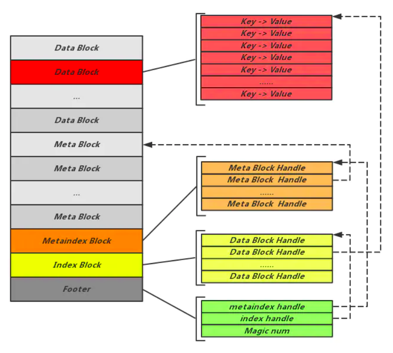
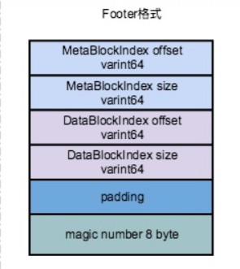
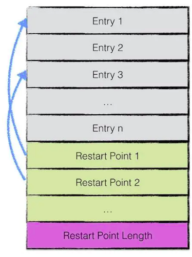
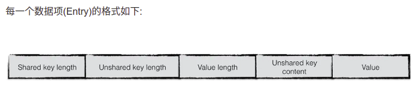
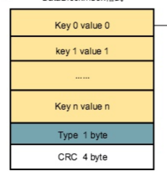
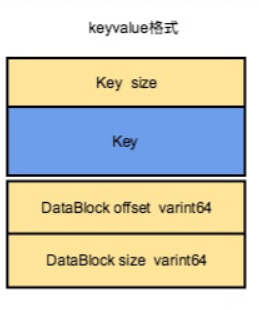

# SST文件结构

LSM tree保证数据是有序写入(memtable – skiplist)，提高了写性能，但是因为其本身的分层结构，牺牲了读性能（一个key如存储在了低级别的level，从上到下每一层都要进行查找，代价极大）。所以，针对读的性能提升有了很多的优化:bloom filter(高效判读一个key是否不存在)，index-filter （二分查找，消耗低内存的情况下）索引key-value数据。这一些数据都需要存储在SST文件之中，用来进行k-v数据的有序管理。

## SST文件格式概览

* 1）Footer ： 固定48字节，指出 IndexBlock 和 MetaIndexBlock 在文件中的偏移量信息，它是元信息的元信息，它位于 sstable 文件的尾部
* 2）IndexBlock：占用一个 block 空间，记录了 DataBlock 相关的元信息
* 3）MetaIndexBlock：占用一个 block 空间，各个元信息的Block，包括Filter、Properties(整个table的属性信息)、Compression dictionary、Range deletion tombstone
* 4）MetaBlock：可能占用多个 block空间，存储布隆过滤器的二进制数据 及其他元信息数据
* 5）DataBlock：可能占用多个 block空间，存储实际的数据即键值对内容

## Footer 结构

Footer固定48个字节大小，位于SSTable文件尾部；MetaBlockIndex和DataBlockIndex的offset和size组成BlockHandlel类型，用于寻址MetaBlockIndex和DataBlcokIndex的块所在的位置，size和offset采用varint变长编码，以节省空间，offset和size最少占用1个字节长度、最多占用9个字节长度，因此MetaBlockIndex和DataBlockIndex的offset和size最多占用4*9=36个字节，通过padding补齐到40个字节（8字节对齐）；
比如DataBlockIndex.offset = 64、DataBlockIndex.size=216，表示DataBlockIndex位于SSTable文件的第64个字节至280个字节；

## Block 结构
5个部分的数据结构，除了 Footer，其他的物理结构都是 Block 形式。每个 Block 对应物理磁盘的一个存储块，因此， Block 的大小与磁盘存储块的大小一致．这也是Footer放到文件末尾的原因，Footer本身４８个字节不能占用一个磁盘存储块．
Block 在硬盘上存储的时候，会在实际数据之后加上5个字节的额外内容：compression type、crc

### Data Block 结构

DataBlcok Key 的存储采用了前缀压缩机制，前缀压缩，就是对于 key 的相同前缀，尽量只存储一次以节省空间。但是对于 SSTable 来说它并不是对整个 block 的所有 key 进行一次性地前缀压缩，而是设置了很多区段，处于同一区段的 key 进行一次前缀压缩，每个区段的起点就是一个重启点。
前缀压缩机制导致每条记录需要记住它对应的 key 的共享长度和非共享长度。所 谓 key 的共享长度，是指当前这条记录的 key 与上一条记录的 key 公共前缀的长 度，非共享长度则是去掉相同部分后的不同部分的长度。这样当前这条记录只需要存储不同的那部分 key 的值即可。

第一部分(Entry)用来存储key-value数据。由于sstable中所有的key-value对都是严格按序存储的，用了节省存储空间，并不会为每一对key-value对都存储完整的key值，而是存储与上一个key非共享的部分，避免了key重复内容的存储。
每间隔若干个key-value对，将为该条记录重新存储一个完整的key。重复该过程（默认间隔值为16），每个重新存储完整key的点称之为Restart point。

Restart point的目的是在读取sstable内容时，加速查找的过程。
由于每个Restart point存储的都是完整的key值，因此在sstable中进行数据查找时，可以首先利用restart point点的数据进行键值比较，以便于快速定位目标数据所在的区域；
当确定目标数据所在区域时，再依次对区间内所有数据项逐项比较key值，进行细粒度地查找；
该思想有点类似于跳表中利用高层数据迅速定位，底层数据详细查找的理念，降低查找的复杂度。

#### KV 数据存储结构

* shared key length: 与　restart point 相同的key前缀字节长度．
* unshared key length:　当前key减去restart point 相同前缀长度后，剩余的字节长度
* value length:　数值的字节长度
* unshared key content:　key与restart point中的key不相同部分的key内容．
* value: 存储真实的数值

### Index Block 结构

index block包含若干条记录，每一条记录代表一个data block的索引信息，用于快速定位到包含特定key的Data Block；Index Block首先是一个block，因此包含三部分KeyValue、Type（固定1字节）、CRC检验码（固定4字节）；Type标识该部分数据是否采用压缩算法，CRC是KeyValue + Type的检验码；  

一条索引包括以下内容：

* key，取值是大于等于其索引block的最大key，并且小于下一个block的最小key；
* 该data block起始地址在sstable中的偏移量；
* 该data block的大小；

IndexBlock和 DataBlock 一样，采取了前缀压缩，只不过间隔为2（DataBlock 默认为16）

#### 为什么key不是采用其索引的DataBlock的最大key？

主要目的是节省空间；假设其索引的block的最大key为"acknowledge"，下一个block最小的key为"apple"，如果DataBlockIndex的key采用其索引block的最大key，占用长度为len("acknowledge")；采用后一种方式，key值可以为"ad"（"acknowledge" < "ad" < "apple"），长度仅为2，并且检索效果是一样的。

#### 为什么BlockHandle的offset和size的单位是字节数而不是block？

因为SSTable中的block大小是不固定的，虽然option中可以指定block_size参数，但SSTable中存储数据时，并未严格按照block_size对齐，所以offset和size指的是偏移字节数和长度字节数。这样做主要有两个原因：  
* （1）可以存储任意长度的key和任意长度的value，而同一个key-value是不能跨block存储的，极端情况下，比如我们的单个 value 就很大，已经超过了 block_size，那么对于这种情况，SSTable 就没法进 行存储了。所以通常，实际的 Block 大小都是要略微大于 block_size 的；
* （2）从另外一个角度看，如果严格按照block_size对齐存储数据，必然有很多block通过补0的方式对齐，浪费存储空间；
