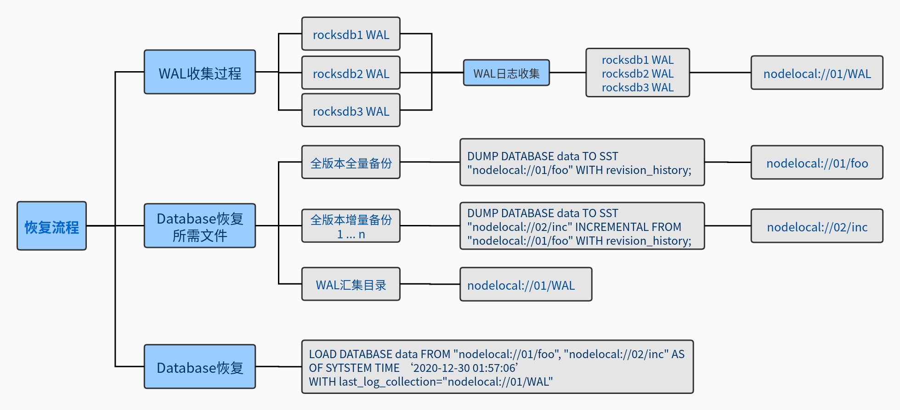
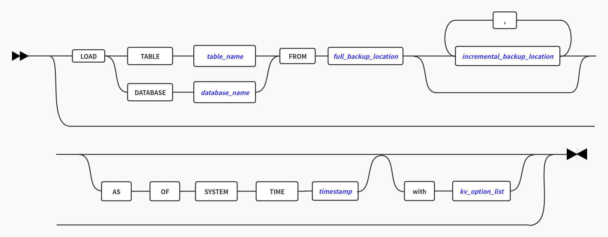

#  基于 WAL 实现ZNBase分布式数据库恢复至任意时间点

## 1. 引言

数据库通常采用数据备份来进行数据库恢复和还原，保证数据安全可靠，数据备份是容灾的基础，传统的数据备份主要是采用内置或外置的存储设备进行冷备份。这样的备份方式能较大程度上保证数据完整性，但由于其一般为每天定时备份一次，会导致数据库系统故障发生在两次定时备份之间时数据部分丢失。而利用WAL日志进行数据库集群任意时间点恢复的方法能最大程度上恢复数据库系统已落盘数据，且在合理配置后能够实现恢复数据库至任意时间点，明显提高数据库可用性和容错容灾能力。

## 2. 目的

 本文主要阐述了一种ZNBase数据库集群基于WAL实现的数据任意时间点恢复的方法，结合数据库全量备份和增量备份数据恢复，能够恢复故障发生前全部落盘数据或恢复至此前任意时间点状态，实现数据库系统高可用，提高系统容错、容灾能力。主要用以解决以下问题：

   1. 数据库发生故障或遭到破坏后，如果要进行数据恢复，传统定时冗余备份不可避免的会丢失部分数据，数据完整性和安全性以及数据库系统的高可用性不够高，用户体验感降低。

   2. 逻辑错误或其他误操作导致数据库出现大量错误数据、脏数据，逐条查找删除耗时耗力，且可能导致缺漏和新的误操作等。

   3. 其他需要恢复数据库到指定时间点的场景。

## 3. 现有技术

### ZNBase

   浪潮云溪NewSQL数据库（ZNBase）是浪潮推出的一款定位于在线事务处理/在线分析处理（HTAP）的融合型数据库产品，实现了一键水平伸缩，强一致性的多副本数据安全、分布式事务、实时 OLAP 等重要特性。ZNBase针对数据恢复实现的LOAD命令，结合各种合理配置，例如 WITH revision_history、AS OF SYSTEM TIME  等，可以使用全量备份和增量备份数据恢复到指定时间点。

### WAL

   WAL即 Write Ahead Log（预写日志），WAL是数据库系统中常见的一种手段，用于保证数据操作的原子性和持久性。在使用 WAL 的系统中，元数据的变更操作写入磁盘之前，先预先写入到一个log文件中，即所有实际要写入磁盘的操作都会被记录在WAL中，这是我们基于WAL进行数据恢复的前提和出发点。

### RocksDB

   RocksDB是ZNBase当前采用的底层存储引擎之一，其Ldb工具提供了dump_wal命令，可以从WAL中读取记录，我们可以利用解析到的记录内容可以还原数据，另外RocksDB还允许设置options.WAL_ttl_seconds来调整WAL保存时间，合理设置此选项可以保证在定时备份期间WAL不被删除，数据不丢失。

## 4. 实现思路

### 整体思路

   利用WAL数据和全量或增量备份DUMP文件，将WAL中的数据模拟一次“增量备份”，装配生成DUMP文件和SST文件之后，按照LOAD还原流程进行数据库恢复。


   1. 各个RocksDB生成的WAL可设置备份和定期删除，保证存留时间>增量备份周期。
   2. 通过一个外部工具汇总到一个WAL汇集目录,里面包含所有RocksDB的WAL。该WAL汇集目录相当于备份时的SST文件。
   3. database/table恢复时，将WAL转换为该database/table的一份增量备份文件（DUMP+SST）。
   4. 按照原导入恢复流程进行database/table级恢复。

### 恢复语法
数据库恢复至任意指定时间点命令示例：
```shell
LOAD DATABASE data FROM “nodelocal://01/foo”, “nodelocal://02/inc” AS OF SYSTEM TIME ‘2020-12-25 07:43:14’ WITH last_log_collection = “nodelocal://03/wal”;
```
​       LOAD数据恢复还原语法图：


### 实现细节

   #### 1. 配置参数
   + WAL_ttl_seconds，WAL_size_limit_MB：WAL文件的超时时间和最大文件size限制。以下是官方参数解释：
```c++
// The following two fields affect how archived logs will be deleted.
// 1. If both set to 0, logs will be deleted asap and will not get into
//    the archive.
// 2. If WAL_ttl_seconds is 0 and WAL_size_limit_MB is not 0,
//    WAL files will be checked every 10 min and if total size is greater
//    then WAL_size_limit_MB, they will be deleted starting with the
//    earliest until size_limit is met. All empty files will be deleted.
// 3. If WAL_ttl_seconds is not 0 and WAL_size_limit_MB is 0, then
//    WAL files will be checked every WAL_ttl_seconds / 2 and those that
//    are older than WAL_ttl_seconds will be deleted.
// 4. If both are not 0, WAL files will be checked every 10 min and both
//    checks will be performed with ttl being first.
```
   + WITH revision_history：启用ZNBase备份历史版本记录。实现恢复数据库至任意时间点必须在DUMP备份数据时开启 revision_history。
   + WITH last_log_collection：LOAD恢复时，用于存放汇集WAL的文件路径，考虑到分布式数据库系统的数据存储特点，为保证数据恢复的准确性，需要将各节点WAL汇集到该路径指定位置分别存放。
   + AS OF SYSTEM TIME：LOAD恢复时指定的要恢复到的时间点，此时间点可指定为数据库停机/故障前任意时间，即：WAL记录的最后时间点之前任意时间。若不需要恢复至此前时间点，只想恢复数据库到停机时状态即可，可不必指定时间。
   #### 2. WAL恢复流程
   + 在LOAD恢复命令解析到WITH last_log_collection参数时，执行LOAD恢复流程之后要先开始执行WAL恢复，将WAL转换为一份增量备份文件（DUMP+SST）。

   + 解析此前备份生成的DUMP文件，组装Descriptors数组。其中要处理的Descriptor具体内容如下：

     ``` go
     type DumpDescriptor struct {
     	StartTime  hlc.Timestamp `protobuf:"bytes,1,opt,name=start_time,json=startTime,proto3" json:"start_time"`
     	EndTime    hlc.Timestamp `protobuf:"bytes,2,opt,name=end_time,json=endTime,proto3" json:"end_time"`
     	MVCCFilter MVCCFilter    `protobuf:"varint,13,opt,name=mvcc_filter,json=mvccFilter,proto3,enum=znbase.icl.dump.MVCCFilter" json:"mvcc_filter,omitempty"`
     	RevisionStartTime hlc.Timestamp `protobuf:"bytes,17,opt,name=revision_start_time,json=revisionStartTime,proto3" json:"revision_start_time"`
     	Spans []roachpb.Span `protobuf:"bytes,3,rep,name=spans,proto3" json:"spans"`
     	IntroducedSpans   []roachpb.Span                      `protobuf:"bytes,15,rep,name=introduced_spans,json=introducedSpans,proto3" json:"introduced_spans"`
     	DescriptorChanges []DumpDescriptor_DescriptorRevision `protobuf:"bytes,16,rep,name=descriptor_changes,json=descriptorChanges,proto3" json:"descriptor_changes"`
     	Files             []DumpDescriptor_File               `protobuf:"bytes,4,rep,name=files,proto3" json:"files"`
     	Descriptors       []sqlbase.Descriptor                `protobuf:"bytes,5,rep,name=descriptors,proto3" json:"descriptors"`
     	CompleteDbs   []github_com_znbasedb_znbase_pkg_sql_sqlbase.ID `protobuf:"varint,14,rep,packed,name=complete_dbs,json=completeDbs,proto3,casttype=github.com/znbasedb/znbase/pkg/sql/sqlbase.ID" json:"complete_dbs,omitempty"`
     	EntryCounts   roachpb.BulkOpSummary                       `protobuf:"bytes,12,opt,name=entry_counts,json=entryCounts,proto3" json:"entry_counts"`
     	Dir           roachpb.DumpSink                            `protobuf:"bytes,7,opt,name=dir,proto3" json:"dir"`
     	FormatVersion uint32                                      `protobuf:"varint,8,opt,name=format_version,json=formatVersion,proto3" json:"format_version,omitempty"`
     	ClusterID     github_com_znbasedb_znbase_pkg_util_uuid.UUID   `protobuf:"bytes,9,opt,name=cluster_id,json=clusterId,proto3,customtype=github.com/znbasedb/znbase/pkg/util/uuid.UUID" json:"cluster_id"`
     	NodeID             github_com_znbasedb_znbase_pkg_roachpb.NodeID                  `protobuf:"varint,10,opt,name=node_id,json=nodeId,proto3,casttype=github.com/znbasedb/znbase/pkg/roachpb.NodeID" json:"node_id,omitempty"`
     	BuildInfo          build.Info                                                 `protobuf:"bytes,11,opt,name=build_info,json=buildInfo,proto3" json:"build_info"`
     	DescriptorCoverage github_com_znbasedb_znbase_pkg_sql_sem_tree.DescriptorCoverage `protobuf:"varint,22,opt,name=descriptor_coverage,json=descriptorCoverage,proto3,casttype=github.com/znbasedb/znbase/pkg/sql/sem/tree.DescriptorCoverage" json:"descriptor_coverage,omitempty"`
     }
     ```

   + 进行WAL日志解析，调用改写自RocksDB的dump_wal方法，处理WAL，并写入临时RocksDB实例，结合Descriptors数组，遍历写入RocksDB实例的内容，按照备份处理逻辑，组装新的DUMP文件并构建SST文件。

   + 回到LOAD执行流程，将WAL转换出的DUMP+SST视为最后一份增量备份，配合此前的全量备份和增量备份实现后续恢复过程，其中涉及到恢复至指定时间点的处理为ZNBase原有处理过程。

## 5. 恢复结果

```sh
# 生成TPCC数据
[root@node25 znbase]$ ./znbase workload init tpcc --warehouses=5 "postgresql://root@localhost:26257?sslmode=disable"
......
# 全量备份
root@localhost:26257/defaultdb> DUMP DATABASE tpcc TO SST 'nodelocal://01/foo' WITH revision_history;
        job_id       |  status   | fraction_completed |  rows   | index_entries | system_records |   bytes    
+--------------------+-----------+--------------------+---------+---------------+----------------+-----------+
  624307489792393217 | succeeded |                  1 | 2595514 |       2750459 |              0 | 411131700  
(1 row)

Time: 2.206077642s
# 插入数据
root@localhost:26257/defaultdb> insert into tpcc.item values (100001, 100001, 'thisisname', 13.14, 'thisisdata');
INSERT 1

Time: 27.466338ms
# 记录当前时间
root@localhost:26257/defaultdb> SELECT CURRENT_TIMESTAMP;
         current_timestamp          
+----------------------------------+
  2021-01-14 03:12:48.631812+00:00  
(1 row)

Time: 785.49µs
# 插入数据
root@localhost:26257/defaultdb> insert into tpcc.item values (100002, 100002, 'thisisname', 13.14, 'thisisdata');
INSERT 1

Time: 5.1237ms
# 增量备份
root@localhost:26257/defaultdb> DUMP DATABASE tpcc TO SST 'nodelocal://02/inc' INCREMENTAL FROM 'nodelocal://01/foo' WITH revision_history;
        job_id       |  status   | fraction_completed | rows | index_entries | system_records | bytes  
+--------------------+-----------+--------------------+------+---------------+----------------+-------+
  624307696412229633 | succeeded |                  1 |    2 |             0 |              0 |    92  
(1 row)

Time: 836.77805ms
# 插入数据
root@localhost:26257/defaultdb> insert into tpcc.item values (100003, 100003, 'thisisname', 13.14, 'thisisdata');
INSERT 1

Time: 4.343813ms
# 记录当前时间
root@localhost:26257/defaultdb> SELECT CURRENT_TIMESTAMP;
         current_timestamp          
+----------------------------------+
  2021-01-14 03:13:26.374895+00:00  
(1 row)

Time: 456.735µs
# 插入数据
root@localhost:26257/defaultdb> insert into tpcc.item values (100004, 100004, 'thisisname', 13.14, 'thisisdata');
INSERT 1

Time: 4.679106ms

# 汇集WAL至节点1指定路径下分别存放，设置WAL留存时间后，归档WAL保存在archive文件夹下
[root@node25 znbase]$ mkdir -p /data2/test/node1/extern/wal/1 /data2/test/node1/extern/wal/2 /data2/test/node1/extern/wal/3  /data2/test/node1/extern/wal/4
[root@node25 znbase]$ cp /data2/test/node1/*.log /data2/test/node1/extern/wal/1
[root@node25 znbase]$ cp /data2/test/node1/archive/* /data2/test/node1/extern/wal/1
[root@node25 znbase]$ 
[root@node25 znbase]$ cp /data3/test/node2/*.log /data2/test/node1/extern/wal/2
[root@node25 znbase]$ cp /data3/test/node2/archive/* /data2/test/node1/extern/wal/2
[root@node25 znbase]$ 
[root@node25 znbase]$ cp /data4/test/node3/*.log /data2/test/node1/extern/wal/3
[root@node25 znbase]$ cp /data4/test/node3/archive/* /data2/test/node1/extern/wal/3
[root@node25 znbase]$ 
[root@node25 znbase]$ cp /data5/test/node4/*.log /data2/test/node1/extern/wal/4
[root@node25 znbase]$ cp /data5/test/node4/archive/* /data2/test/node1/extern/wal/4
# drop数据库
root@localhost:26257/defaultdb> DROP DATABASE tpcc CASCADE;
DROP DATABASE

Time: 1.633248909s
# 恢复数据库到全量备份和增量备份之间指定时间
root@localhost:26257/defaultdb> LOAD DATABASE tpcc FROM 'nodelocal://01/foo', 'nodelocal://02/inc' AS OF SYSTEM TIME '2021-01-14 03:12:48.631812+00:00' WITH last_log_collection='nodelocal://01/wal';
        job_id       |  status   | fraction_completed |  rows   | index_entries | system_records |   bytes    
+--------------------+-----------+--------------------+---------+---------------+----------------+-----------+
  624308437874343937 | succeeded |                  1 | 2595515 |       2750459 |              0 | 411131746  
(1 row)

Time: 1m11.996016429s
# 验证数据，结果准确
root@localhost:26257/defaultdb> SELECT * FROM tpcc.item where i_id >100000;
   i_id  | i_im_id |   i_name   | i_price |   i_data    
+--------+---------+------------+---------+------------+
  100001 |  100001 | thisisname |   13.14 | thisisdata  
(1 row)

Time: 29.568069ms

root@localhost:26257/defaultdb> DROP DATABASE tpcc CASCADE;
DROP DATABASE

Time: 1.663632402s
# 恢复数据到利用WAL恢复的时间段内
root@localhost:26257/defaultdb> LOAD DATABASE tpcc FROM 'nodelocal://01/foo', 'nodelocal://02/inc' AS OF SYSTEM TIME '2021-01-14 03:13:26.374895+00:00' WITH last_log_collection='nodelocal://01/wal';
        job_id       |  status   | fraction_completed |  rows   | index_entries | system_records |   bytes    
+--------------------+-----------+--------------------+---------+---------------+----------------+-----------+
  624308886599106561 | succeeded |                  1 | 2595517 |       2750459 |              0 | 411131838  
(1 row)

Time: 1m8.210220184s
# 验证数据，结果准确
root@localhost:26257/defaultdb> SELECT * FROM tpcc.item where i_id >100000;
   i_id  | i_im_id |   i_name   | i_price |   i_data    
+--------+---------+------------+---------+------------+
  100001 |  100001 | thisisname |   13.14 | thisisdata  
  100002 |  100002 | thisisname |   13.14 | thisisdata  
  100003 |  100003 | thisisname |   13.14 | thisisdata  
(3 rows)

Time: 32.426841ms
```

