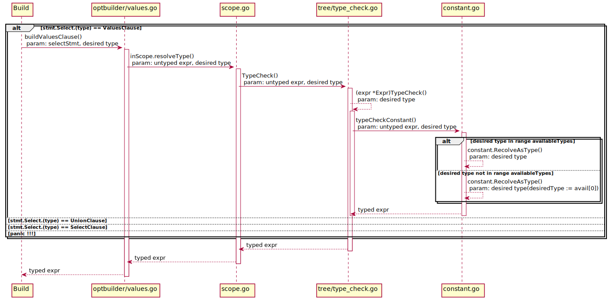
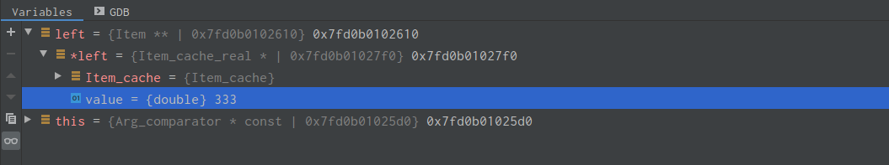

[toc]

## 隐式类型转换需求

ICDB基于ZNBase数据库进行开发，原有数据库对隐式类型转化的支持不完善，在一些引用场景下，客户需要使用隐式类型转换，所以需要ICDB支持隐式类型转换。
原有数据库对于一条简单的查询：
```sql
select 1+'1.1';
```
得不到一个正确的答案，而是报出error:
同样的语句在MySQL中则可以得到正确的结果，
```sql
mysql> select 1+'1.1';
+---------+
| 1+'1.1' |
+---------+
|     2.1 |
+---------+
```
通过对ZNBase和MySQL隐式类型转换的相关调研，得到下面这两个类型之间的隐式转换表格
#### ZNBase类型转换关系

|           | To Int | To Date | To Float | To Interval | To String | To Decimal | To Bool | To Timestamp |
|-----------|--------|---------|----------|-------------|-----------|------------|---------|--------------|
| Int       | —      | ×       | √        | ×           | ×         | √          | ×       | ×            |
| Date      | ×      | —       | ×        | ×           | ×         | ×          | ×       | ×            |
| Float     | ×      | ×       | —        | ×           | ×         | ×          | ×       | ×            |
| Interval  | ×      | ×       | ×        | —           | ×         | ×          | ×       | ×            |
| String    | √      | √       | √        | √           | —         | √          | √       | √            |
| Decimal   | ×      | ×       | ×        | ×           | ×         | ×          | ×       | ×            |
| Bool      | ×      | ×       | ×        | ×           | ×         | ×          | —       | ×            |
| Timestamp | ×      | ×       | ×        | ×           | ×         | ×          | ×       | —            |

#### MySQL类型转换关系

|           | To Int | To Date | To Float | To Text | To Decimal | To Bool | To Timestamp |
|-----------|--------|---------|----------|---------|------------|---------|--------------|
| Int       | —      | √       | √        | √       | √          | √       | √            |
| Date      | √      | —       | √        | √       | √          | ×       | √            |
| Float     | √      | ×       | —        | √       | √          | √       | ×            |
| Text      | √      | √       | √        | —       | √          | √       | √            |
| Decimal   | √      | ×       | √        | √       | √          | √       | ×            |
| Bool      | √      | ×       | √        | √       | √          | —       | ×            |
| Timestamp | √      | √       | √        | √       | √          | ×       | —            |

可以看出，确实很多类型之间的隐式类型转换并没有支持，所以参考MySQL对隐式类型的支持，完善ICDB对隐式类型转换的支持

## ZNBase中build select时序图



## 设计思路

经过调研发现，ZNBase中每一个类型各自对应一个`AvailableTypes`的可转换候选类型列表，以int为例，`expr.Kind() == constant.Int`时，此expr的候选类型列表为`NumValAvailInteger = [int, oid, decimal, float]`。

所以当前的设计思路为，对ZNBase原有类型的可转换候选类型列表进行扩充，对新扩充的数据类型添加与原类型之间的转换关系或函数，使得在不改动原有ZNBase整体结构的基础上实现ICDB对隐式类型转换的支持。


## MySQL显示类型转换（调用`cast()`函数）

对于命令
```sql
mysql> select cast('100.00111' as DECIMAL);
```
会调用函数
```c++
val_decimal_from_string
```

mysql中定义了一些有关cast的类，如下：
```c++
Item_typecast_char
Item_typecast_date
Item_typecast_time
Item_typecast_datetime
Item_typecast_decimal
Item_typecast_json
Item_typecast_real
Item_typecast_signed
Item_typecast_unsigned
```

每一个类都继承了函数
```c++
String      *val_str(String *str);
my_decimal  *val_decimal(my_decimal *decimal_value);
longlong    val_int();
bool        get_date(MYSQL_TIME *ltime, my_time_flags_t fuzzydate);
bool        get_time(MYSQL_TIME *ltime);
```

不同的类实例调用这些函数时会分别调用下面是这些转换函数

#### 转为string
```c++
String *val_string_from_real(String *str);
String *val_string_from_int(String *str);
String *val_string_from_decimal(String *str);
String *val_string_from_date(String *str);
String *val_string_from_datetime(String *str);
String *val_string_from_time(String *str);
```

#### 转为int
```c++
longlong val_int_from_decimal();
longlong val_int_from_date();
longlong val_int_from_time();
longlong val_int_from_datetime();
longlong val_int_from_str(int *);
```

#### 转为decimal
```c++
my_decimal *val_decimal_from_real(my_decimal *decimal_value);
my_decimal *val_decimal_from_int(my_decimal *decimal_value);
my_decimal *val_decimal_from_string(my_decimal *decimal_value);
my_decimal *val_decimal_from_date(my_decimal *decimal_value);
my_decimal *val_decimal_from_time(my_decimal *decimal_value);
```

#### 转为date
```c++
bool get_date_from_string(MYSQL_TIME *ltime, my_time_flags_t flags)
bool get_date_from_real(MYSQL_TIME *ltime, my_time_flags_t flags);
bool get_date_from_decimal(MYSQL_TIME *ltime, my_time_flags_t flags);
bool get_date_from_int(MYSQL_TIME *ltime, my_time_flags_t flags);
bool get_date_from_time(MYSQL_TIME *ltime);
bool get_date_from_numeric(MYSQL_TIME *ltime, my_time_flags_t fuzzydate);
```

#### 转为time
```c++
bool get_time_from_string(MYSQL_TIME *ltime);
bool get_time_from_real(MYSQL_TIME *ltime);
bool get_time_from_decimal(MYSQL_TIME *ltime);
bool get_time_from_int(MYSQL_TIME *ltime);
bool get_time_from_date(MYSQL_TIME *ltime);
bool get_time_from_datetime(MYSQL_TIME *ltime);
bool get_time_from_numeric(MYSQL_TIME *ltime);
```

#### 转为real
```c++
double val_real_from_decimal();
/*
 * 对于其他的类型转为real，并没有提供专门的函数，
 * 但是所有继承于item的类，都有一个成员方法 val_real()，可由此得到对应的real类型的值
*/
```

相似类型之间多直接使用类型强转，比方说longlong和double直接的类型互转
```c++
#define ulonglong2double(A) ((double)(ulonglong)(A))
#define double2ulonglong(A) ((ulonglong)(double)(A))
```

----

## MySQL隐式类型转换

以上均为显示类型转换会调用的函数。对于**隐式类型转换**，还没有确定发生隐式类型转换的位置

对于命令
```sql
mysql> select '333'>43;
```
会经过`item_cmpfunc.cc`中的函数
```c++
int Arg_comparator::compare_real() {
  /*
    Fix yet another manifestation of Bug#2338. 'Volatile' will instruct
    gcc to flush double values out of 80-bit Intel FPU registers before
    performing the comparison.
  */
  volatile double val1, val2;
  val1 = (*left)->val_real();
  if (!(*left)->null_value) {
    val2 = (*right)->val_real();
    if (!(*right)->null_value) {
      if (set_null) owner->null_value = 0;
      if (val1 < val2) return -1;
      if (val1 == val2) return 0;
      return 1;
    }
  }
  if (set_null) owner->null_value = 1;
  return -1;
}
```

#### 此时left的类型和值

发现参数已发生隐式类型转换，具体发生隐式类型转换的位置暂未确定
